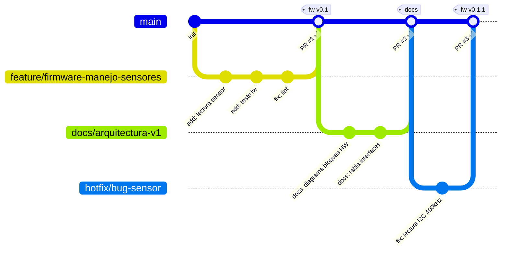

# Proyecto de demostración de documentación

Este repositorio muestra cómo vamos a organizar código y documentación
para los proyectos del equipo (hardware, firmware y software), incluyendo
evidencia para madurez tecnológica (TRL) y posibles requisitos regulatorios.

---

## Índice

- [Estructura del repositorio](#estructura-del-repositorio)
- [Flujo de trabajo](#flujo-de-trabajo)
  - [Convención de ramas](#convención-de-ramas)
  - [Commits](#commits)
  - [Pull Requests (PR)](#pull-requests-pr)
- [Documentación y evidencias](#documentación-y-evidencias)
- [Guía rápida para el equipo](#guía-rápida-para-el-equipo)
  - [Cómo empezar (configuración inicial)](#cómo-empezar-configuración-inicial)
  - [Cómo crear una rama](#cómo-crear-una-rama)
  - [Cómo hacer un commit](#cómo-hacer-un-commit)
  - [Cómo abrir un Pull Request](#cómo-abrir-un-pull-request)
  - [Cómo revisar y aprobar un PR](#cómo-revisar-y-aprobar-un-pr)

---

## Estructura del repositorio

```text
/docs
  00_overview.md
  01_producto_uso_previsto.md
  02_requisitos.md
  03_arquitectura.md
  04_diseno_hw.md
  05_diseno_fw.md
  06_diseno_sw.md
  07_pruebas_plan.md
  08_pruebas_resultados.md
  09_riesgos.md
/hardware
/firmware
/software
/trl
  trl1.md
  trl2.md
  ...
  trlN.md
```

- `/docs`: documentación de alto nivel (producto, requisitos, arquitectura,
  diseño, pruebas y riesgos).
- `/hardware`: esquemáticos, PCB, BOM y elementos mecánicos.
- `/firmware`: código para dispositivos embebidos y su documentación.
- `/software`: backend, APIs, dashboards y herramientas de soporte.
- `/trl`: documentación y evidencia para cada nivel de madurez tecnológica.

Para una descripción más detallada del proyecto, ver [`docs/00_overview.md`](docs/00_overview.md).

---

## Flujo de trabajo

La rama principal es `main` y está **protegida**: no se hacen commits directos,
solo se actualiza mediante Pull Requests revisados y aprobados.



> ⚠️ **Nunca** hacer commit directo a `main`. Todo cambio entra por Pull Request.

### Convención de ramas

| Tipo                                   | Patrón                  | Ejemplo                            |
| -------------------------------------- | ----------------------- | ---------------------------------- |
| Nueva funcionalidad o cambio de código | `feature/<descripcion>` | `feature/firmware-manejo-sensores` |
| Documentación                          | `docs/<descripcion>`    | `docs/arquitectura-v1`             |
| Corrección urgente                     | `hotfix/<descripcion>`  | `hotfix/bug-sensor`                |

### Commits

Los mensajes de commit siguen el formato `tipo: descripción corta`:

| Tipo    | Uso                                             |
| ------- | ----------------------------------------------- |
| `feat`  | Nueva funcionalidad                             |
| `fix`   | Corrección de bug                               |
| `docs`  | Cambio solo de documentación                    |
| `chore` | Tareas de mantenimiento (configs, dependencias) |
| `test`  | Agregar o modificar pruebas                     |

Ejemplos:

- `feat: agrega lectura de sensor de temperatura`
- `docs: actualiza tabla de requisitos HW`
- `fix: corrige intervalo de muestreo en firmware`

### Pull Requests (PR)

Cuando abres un PR, GitHub carga automáticamente una plantilla con los campos
a llenar. Como mínimo indica:

- Resumen del cambio.
- Áreas y archivos afectados.
- Requisitos, pruebas o riesgos relacionados (si aplica).

> 📝 **Nota:** Hay responsables por área (hardware, firmware, software).
> Al abrir un PR que toque `/hardware`, `/firmware` o `/software`,
> asigna manualmente como Reviewer al responsable correspondiente.

---

## Documentación y evidencias

- La documentación funcional y técnica vive en `/docs`.
- Las pruebas se planifican en [`docs/07_pruebas_plan.md`](docs/07_pruebas_plan.md)
  y los resultados en [`docs/08_pruebas_resultados.md`](docs/08_pruebas_resultados.md).
- Los riesgos se gestionan en [`docs/09_riesgos.md`](docs/09_riesgos.md).
- La evidencia de madurez tecnológica se registra en `/trl`.

---

## Guía rápida para el equipo

Esta sección es para personas que están comenzando a usar Git y GitHub.
No es necesario ser experto; con estos pasos cubre el 90% del trabajo diario.

### Cómo empezar (configuración inicial)

Solo se hace una vez:

1. Instala [Git](https://git-scm.com/downloads) en tu máquina.
2. Configura tu nombre y correo:
   ```bash
   git config --global user.name "Tu Nombre"
   git config --global user.email "tu@correo.com"
   ```
3. Clona el repositorio:
   ```bash
   git clone https://github.com/USUARIO/REPO.git
   cd REPO
   ```

### Cómo crear una rama

Siempre parte desde `main` actualizado:

```bash
git checkout main
git pull origin main

# Crea un branch (rama)
git checkout -b tipo/descripcion-corta
```

Ejemplo:

```bash
git checkout -b docs/requisitos-iniciales
```

### Cómo hacer un commit

Después de modificar uno o varios archivos:

```bash
git status                          # ver qué cambió
git add ruta/al/archivo.md          # agregar archivo al stage
git commit -m "docs: descripción del cambio"
git push origin nombre-de-tu-rama
```

### Cómo abrir un Pull Request

1. Ve al repositorio en GitHub.
2. Aparecerá un banner: **"rama-X had recent pushes — Compare & pull request"**.
3. Clic en ese botón.
4. Llena la plantilla que aparece automáticamente.
5. En el panel derecho, en **Reviewers**, asigna al responsable del área.
6. Clic en **Create pull request**.

### Cómo revisar y aprobar un PR

Cuando alguien te asigne como reviewer:

1. Entra al PR en GitHub.
2. Clic en la pestaña **Files changed** para ver qué cambió.
3. Puedes dejar comentarios línea por línea si algo no está claro.
4. Cuando estés conforme, clic en **Review changes** → selecciona **Approve** → **Submit review**.
5. El autor del PR puede entonces hacer **Merge pull request**.
