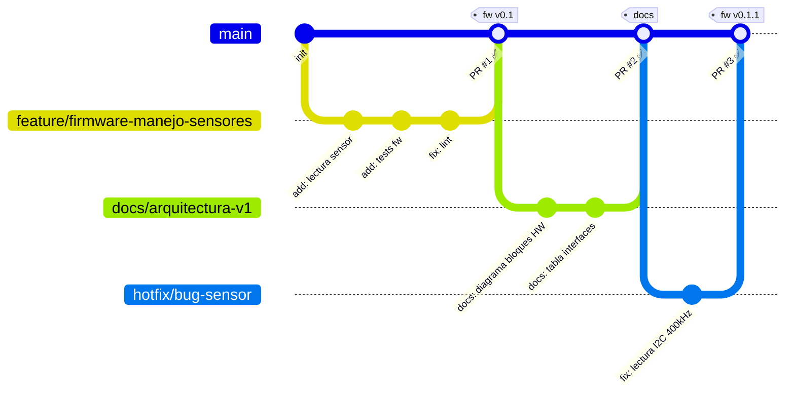

# Proyecto de demostración de documentación

Este repositorio muestra cómo vamos a organizar código y documentación
para los proyectos del equipo (hardware, firmware y software), incluyendo
evidencia para madurez tecnológica (TRL) y posibles requisitos regulatorios.

## Estructura del repositorio

```text
/docs
  00_overview.md
  01_producto_uso_previsto.md
  02_requisitos.md
  03_arquitectura.md
  04_diseno_hw.md
  05_diseno_fw.md
  06_diseno_sw.md
  07_pruebas_plan.md
  08_pruebas_resultados.md
  09_riesgos.md
/hardware
/firmware
/software
/trl
  trl1.md
  trl2.md
  ...
  trlN.md
```

- `/docs`: documentación de alto nivel (producto, requisitos, arquitectura,
  diseño, pruebas, TRL y riesgos).
- `/hardware`: esquemáticos, PCB, BOM y elementos mecánicos.
- `/firmware`: código para dispositivos embebidos y su documentación.
- `/software`: backend, APIs, dashboards y herramientas de soporte.
- `/trl`: documentacion y evidencia relevante para cada nivel de TRL.

Para una descripción más detallada del proyecto, ver `docs/00_overview.md`.

## Flujo de trabajo (Simplificado)

1. La rama principal es `main`. Aquí solo va trabajo revisado y estable.

- `main` está protegida: no se hacen commits directos, solo se actualiza mediante PR
  (pull requests).

2. Cada cambio relevante se hace en una rama nueva creada desde `main`:
   - Si es una funcionalidad nueva o cambio de código:
     - Ejemplos:
       - `feature/requisitos-iniciales` (agregar los primeros requisitos al sistema).
       - `feature/firmware-manejo-sensores` (nueva lógica en firmware).
   - Si es un cambio de documentación:
     - Ejemplos:
       - `docs/arquitectura-v1` (primera versión de `03_arquitectura.md`).
       - `docs/actualiza-pruebas-plan` (ajustes en `07_pruebas_plan.md`).

   Cada nombre de rama sigue la forma `tipo/descripcion-corta`, donde `tipo` suele ser `feature` o `docs` (y en casos especiales se podría usar `hotfix`).

3. En la rama se modifican los archivos necesarios (código y/o docs) y se crean commits con mensajes claros.
4. Cuando el cambio está listo, se crea un **Pull Request (PR)** hacia `main`.
5. En el PR se indica, como mínimo:
   - Resumen breve del cambio.
   - Lista de archivos o áreas afectadas.
   - Si aplica, requisitos, pruebas o riesgos relacionados.

6. Los PR se revisan antes de hacer _merge_ a `main`.
   - Habrá responsables por área (hardware, firmware, software) que revisan los cambios en sus carpetas.
   - A futuro, se configurarán reglas de rama y `CODEOWNERS` para que los cambios en `/hardware`, `/firmware` o `/software` requieran revisión del responsable correspondiente.
   > ⚠️ **Upgrade to GitHub Pro or make this repository public to enable CODEOWNERS.**

## Flujo de trabajo con Git

La rama principal es `main` y está **protegida**: no se hacen commits directos, solo se actualiza mediante Pull Requests revisados.



### Convención de ramas

| Tipo                                   | Patrón                  | Ejemplo                            |
| -------------------------------------- | ----------------------- | ---------------------------------- |
| Nueva funcionalidad o cambio de código | `feature/<descripcion>` | `feature/firmware-manejo-sensores` |
| Documentación                          | `docs/<descripcion>`    | `docs/arquitectura-v1`             |
| Corrección urgente                     | `hotfix/<descripcion>`  | `hotfix/bug-sensor`                |

> ⚠️ **Nunca** hacer commit directo a `main`. Todo cambio entra por Pull Request.

## Documentación y evidencias

- La documentación funcional y técnica vive en la carpeta `/docs`.
- La evidencia de pruebas y resultados se captura en:
  - `docs/07_pruebas_plan.md`
  - `docs/08_pruebas_resultados.md`
- La gestión de riesgos se documenta en `docs/09_riesgos.md`.
- La información relacionada con TRL se registra en `trl/`.
