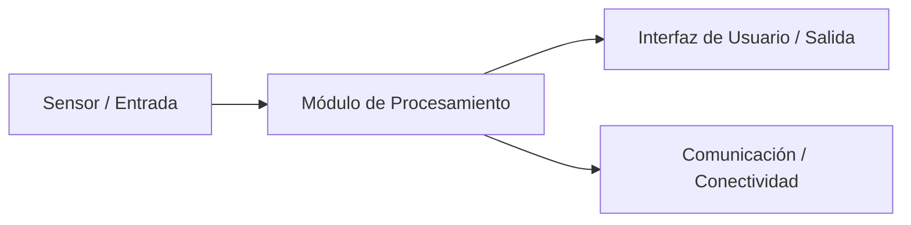

# Visión General del Proyecto

> **Versión:** 0.1  
> **Fecha:** AAAA-MM-DD  
> **Responsable:** [Nombre]  
> **Estado:** Borrador / En revisión / Aprobado

---

## 1. Objetivo del Proyecto

<!-- Descripción concisa (2–4 oraciones) de qué se está desarrollando y por qué. -->

_Desarrollar un dispositivo embebido para monitoreo de [temperatura] y [humeradad] en un laboratorio._

---

## 2. Contexto y Justificación

<!-- ¿Qué problema resuelve? ¿Por qué es relevante? ¿Qué no existe actualmente o qué mejora respecto al estado del arte? -->

---

## 3. Alcance

### 3.1 Incluye

- Dispositivo embebido que mide temperatura y humedad en un laboratorio y envía datos a un backend.

- Un backend almacena las mediciones y una pequeña API permite consultarlas y mostrarlas en un dashboard web.

### 3.2 Excluye (fuera de alcance)

- ...
- ...

---

## 4. Entregables Principales

| #   | Entregable | Descripción breve | Fecha estimada |
| --- | ---------- | ----------------- | -------------- |
| 1   |            |                   |                |
| 2   |            |                   |                |
| 3   |            |                   |                |

---

## 5. Stakeholders

| Nombre / Organización | Rol                         | Interés / Responsabilidad |
| --------------------- | --------------------------- | ------------------------- |
|                       | Líder técnico               |                           |
|                       | Patrocinador / Convocatoria |                           |
|                       | Usuario final               |                           |
|                       | Asesor regulatorio          |                           |

---

## 6. Diagrama General del Sistema

<!-- Insertar imagen o diagrama de bloques de alto nivel -->
<!-- Ejemplo con imagen:  -->
<!-- Ejemplo con Mermaid: -->



---

## 7. Roadmap e Hitos Principales

| Hito | Descripción                          | TRL Objetivo | Fecha Estimada | Estado       |
| ---- | ------------------------------------ | ------------ | -------------- | ------------ |
| H1   | Prueba de concepto                   | TRL 2–3      |                | ⬜ Pendiente |
| H2   | Prototipo funcional en laboratorio   | TRL 4        |                | ⬜ Pendiente |
| H3   | Validación en entorno relevante      | TRL 5–6      |                | ⬜ Pendiente |
| H4   | Entrega convocatoria / reporte final | —            |                | ⬜ Pendiente |

> **Estados:** ⬜ Pendiente · 🔄 En progreso · ✅ Completado · ⚠️ En riesgo

---

## 8. Repositorio y Estructura

```text
/docs
  00_overview.md
  01_producto_uso_previsto.md
  02_requisitos.md
  03_arquitectura.md
  04_diseno_hw.md
  05_diseno_fw.md
  06_diseno_sw.md
  07_pruebas_plan.md
  08_pruebas_resultados.md
  09_riesgos.md
/hardware
/firmware
/software
/trl
  trl1.md
  trl2.md
  ...
  trlN.md
```

---

## 9. Convenciones del Proyecto

- **Etiquetas de issues:** `hw`, `fw`, `sw`, `req`, `test`, `bug`, `evidencia`, `trl2`, `trl3`, …
- **Definition of Done:** Toda tarea cerrada debe referenciar al menos un requisito y dejar una nota/actualización en el documento correspondiente.
- **Mensajes de commit:** `[Módulo]: descripción breve (refs #issue)` — ej. `Docs: actualiza arquitectura HW v0.2 (refs #12)`

---

## 10. Historial de Cambios

| Versión | Fecha      | Autor | Cambios          |
| ------- | ---------- | ----- | ---------------- |
| 0.1     | AAAA-MM-DD |       | Creación inicial |
