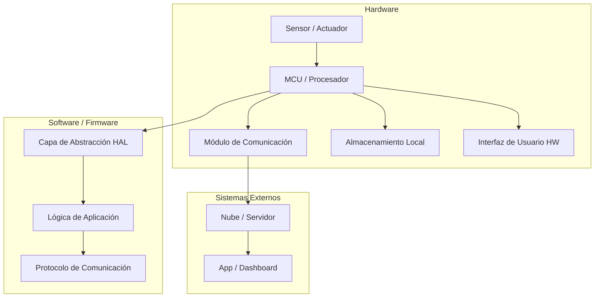
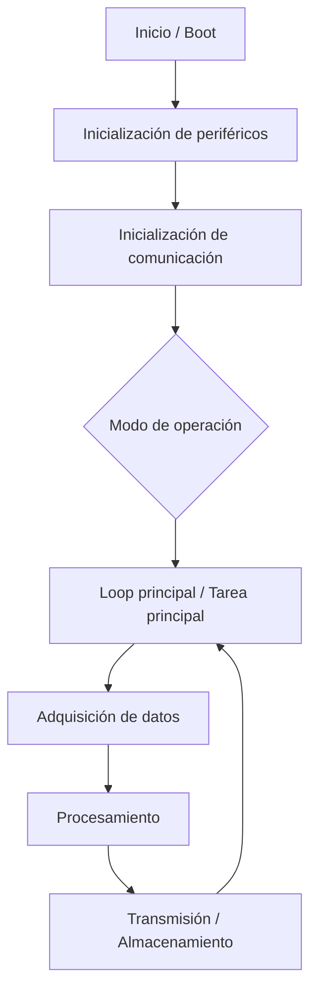

# Arquitectura del Sistema

> **Versión:** 0.1  
> **Fecha:** AAAA-MM-DD  
> **Responsable:** [Nombre]  
> **Estado:** Borrador / En revisión / Aprobado

---

## 1. Visión General de la Arquitectura

<!-- Descripción de alto nivel de cómo están organizados los subsistemas y cómo se relacionan entre sí. -->



---

## 2. Subsistemas y Módulos

| Subsistema | Módulo               | Descripción breve                                         | Tecnología / Componente clave          |
| ---------- | -------------------- | --------------------------------------------------------- | -------------------------------------- |
| Hardware   | Adquisición de señal | Medición de T/RH mediante sensor digital                  | Sensor tipo SHT3x + MCU ESP32          |
| Firmware   | Aplicación principal | Lee sensor y envía lecturas periódicas al backend         | C en ESP-IDF / Arduino-ESP32           |
| Firmware   | Comunicación         | Cliente HTTP/MQTT para envío de datos                     | Wi-Fi + protocolo HTTP/REST o MQTT     |
| Software   | Backend / Servidor   | Recibe, almacena y expone mediciones vía API              | Python (FastAPI) + SQLite              |
| Software   | Interfaz de usuario  | Dashboard web simple para visualizar T/RH actual y pasada | HTML/JS o pequeño frontend (p.ej. Vue) |

---

## 3. Diagrama de Bloques de Hardware

<!-- Insertar diagrama o describir los bloques principales del hardware. -->


### 3.1 Descripción de Bloques

| Bloque | Función | Componente(s) | Notas |
| ------ | ------- | ------------- | ----- |
|        |         |               |       |

---

## 4. Arquitectura de Firmware

### 4.1 Capas de Software Embebido

```
┌────────────────────────────────────┐
│         Aplicación / Lógica        │
├────────────────────────────────────┤
│     Middleware / Servicios         │
├────────────────────────────────────┤
│   HAL / Drivers (abstracción HW)   │
├────────────────────────────────────┤
│         RTOS / Bare-metal          │
├────────────────────────────────────┤
│           Hardware (MCU)           │
└────────────────────────────────────┘
```

### 4.2 Módulos de Firmware

| Módulo | Descripción | Archivo(s) principal(es) | Dependencias |
| ------ | ----------- | ------------------------ | ------------ |
|        |             |                          |              |

### 4.3 Flujo de Ejecución Principal



---

## 5. Arquitectura de Software

### 5.1 Componentes Principales

| Componente | Descripción | Tecnología | Repositorio / Ruta |
| ---------- | ----------- | ---------- | ------------------ |
|            |             |            |                    |

### 5.2 Diagrama de Componentes

<!-- Insertar diagrama o usar Mermaid -->

---

## 6. Interfaces Clave

### 6.1 Interfaces de Hardware

| Interfaz         | Tipo                   | Señales / Pines | Protocolo | Velocidad / Parámetros |
| ---------------- | ---------------------- | --------------- | --------- | ---------------------- |
| MCU ↔ Sensor     | SPI / I2C / UART / ADC |                 |           |                        |
| MCU ↔ Módulo COM |                        |                 |           |                        |
| MCU ↔ Memoria    |                        |                 |           |                        |

### 6.2 Interfaces de Software / API

| Interfaz     | Tipo                  | Descripción | Formato de datos    |
| ------------ | --------------------- | ----------- | ------------------- |
| FW ↔ Backend | REST / MQTT / BLE / … |             | JSON / Protobuf / … |
| Backend ↔ UI |                       |             |                     |

### 6.3 Protocolos de Comunicación

| Protocolo | Capa | Uso en el sistema | Estándar / Especificación |
| --------- | ---- | ----------------- | ------------------------- |
|           |      |                   |                           |

---

## 7. Decisiones de Arquitectura Relevantes

> Registrar aquí decisiones importantes de arquitectura: qué se eligió, qué alternativas se consideraron y por qué se tomó la decisión.

| #   | Decisión                                        | Alternativas consideradas | Razón de la elección                                | Fecha      |
| --- | ----------------------------------------------- | ------------------------- | --------------------------------------------------- | ---------- |
| 1   | Comunicaciones vía Wi-Fi y HTTP REST al backend | MQTT, BLE, RS-485         | Facilidad de test en laboratorio y herramientas web | AAAA-MM-DD |

---

## 8. Restricciones y Suposiciones

### Restricciones

- ...
- ...

### Suposiciones

- ...
- ...

---

## 9. Historial de Cambios

| Versión | Fecha      | Autor | Cambios          |
| ------- | ---------- | ----- | ---------------- |
| 0.1     | AAAA-MM-DD |       | Creación inicial |
