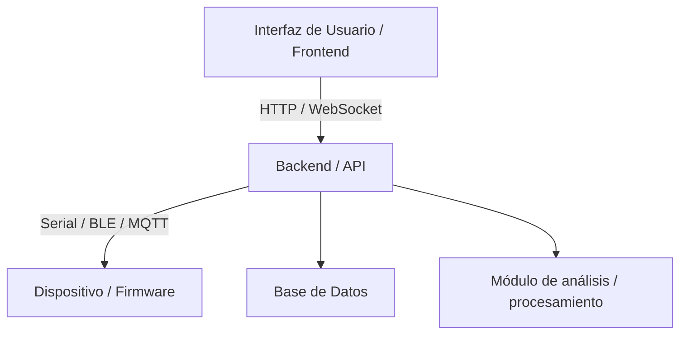
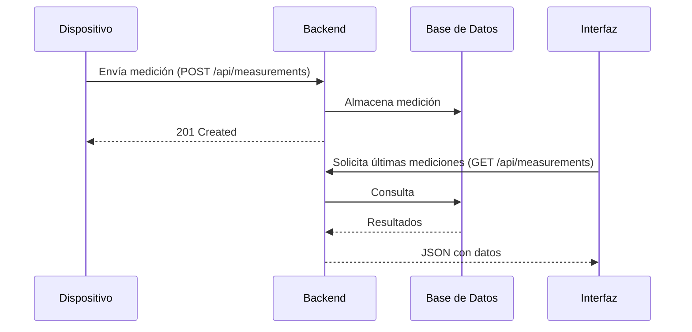

# Diseño de Software

> **Versión:** 0.1  
> **Fecha:** AAAA-MM-DD  
> **Responsable:** [Nombre]  
> **Estado:** Borrador / En revisión / Aprobado

---

## 1. Descripción General

<!-- Qué hace el software (aplicación, backend, herramienta, dashboard, etc.), en qué plataforma corre, y cómo se relaciona con el resto del sistema. -->

| Parámetro | Valor |
|-----------|-------|
| Tipo de software | Backend / Frontend / Desktop App / Scripts / … |
| Lenguaje(s) | Python / JavaScript / C++ / … |
| Framework(s) | FastAPI / React / Qt / … |
| Plataforma de ejecución | Linux / Windows / Contenedor Docker / Nube / … |
| Repositorio / Ruta | `/software/` |

---

## 2. Versiones de Software

| Versión | Fecha | Cambios principales | Compatible con FW |
|---------|-------|---------------------|-------------------|
| v0.1.0 | | Primera versión funcional | v0.1.x |

---

## 3. Arquitectura de Software



### 3.1 Componentes Principales

| Componente | Descripción | Tecnología | Ruta |
|------------|-------------|------------|------|
| API / Backend | | | `/software/backend/` |
| UI / Frontend | | | `/software/frontend/` |
| Módulo de comunicación | Interfaz con el dispositivo | | `/software/comm/` |
| Módulo de análisis | Procesamiento de datos | | `/software/analysis/` |
| Base de datos | Almacenamiento de mediciones | SQLite / PostgreSQL / … | |

---

## 4. Módulos de Software

| Módulo | Descripción | Archivo(s) / Paquete | Dependencias |
|--------|-------------|----------------------|--------------|
| | | | |
| | | | |

---

## 5. Interfaces y API

### 5.1 API REST (si aplica)

| Endpoint | Método | Descripción | Request | Response |
|----------|--------|-------------|---------|----------|
| `/api/devices` | GET | Lista dispositivos registrados | — | JSON array |
| `/api/measurements` | POST | Recibe medición del dispositivo | JSON payload | 201 Created |
| `/api/measurements/{id}` | GET | Obtiene medición por ID | — | JSON object |

### 5.2 Protocolo con Dispositivo (si aplica)

<!-- Describir cómo el software se comunica con el firmware. Puede referenciar 05_diseno_fw.md §8.3. -->

---

## 6. Modelo de Datos

### 6.1 Entidades Principales

```
Measurement
├── id: UUID
├── device_id: string
├── timestamp: datetime
├── value: float
├── unit: string
└── metadata: JSON

Device
├── id: UUID
├── name: string
├── firmware_version: string
└── last_seen: datetime
```

### 6.2 Diagrama ER (si aplica)

<!-- Insertar diagrama o usar Mermaid erDiagram -->

---

## 7. Flujos Principales

### 7.1 Flujo de Adquisición de Datos



---

## 8. Estándar de Código

### 8.1 Convenciones

| Lenguaje | Guía de estilo | Linter / Formatter |
|----------|----------------|-------------------|
| Python | PEP 8 | `ruff`, `black` |
| JavaScript | Airbnb / Standard | `eslint`, `prettier` |

### 8.2 Documentación

- Funciones públicas documentadas con docstrings (Python) o JSDoc (JS).
- Módulos con un `README.md` interno si son suficientemente complejos.

---

## 9. Dependencias Externas

| Librería / Servicio | Versión | Propósito | Licencia |
|---------------------|---------|-----------|----------|
| | | | |
| | | | |

> **Archivo de dependencias:** `requirements.txt` / `package.json` / `pyproject.toml`

---

## 10. Despliegue y Configuración

### 10.1 Variables de Entorno

| Variable | Descripción | Valor por defecto |
|----------|-------------|-------------------|
| `DB_URL` | URL de conexión a base de datos | `sqlite:///local.db` |
| `DEVICE_PORT` | Puerto serial del dispositivo | `/dev/ttyUSB0` |
| `LOG_LEVEL` | Nivel de logging | `INFO` |

### 10.2 Instrucciones de Instalación

```bash
# Clonar repositorio
git clone [repo_url]
cd software/

# Instalar dependencias
pip install -r requirements.txt   # Python
# o
npm install                        # Node.js

# Configurar entorno
cp .env.example .env
# Editar .env con los valores correspondientes

# Ejecutar
python main.py
```

---

## 11. Decisiones de Diseño

| # | Decisión | Alternativas | Razón | Fecha |
|---|----------|--------------|-------|-------|
| 1 | | | | |
| 2 | | | | |

---

## 12. Historial de Cambios

| Versión | Fecha | Autor | Cambios | Motivo |
|---------|-------|-------|---------|--------|
| 0.1 | AAAA-MM-DD | | Creación inicial | |
