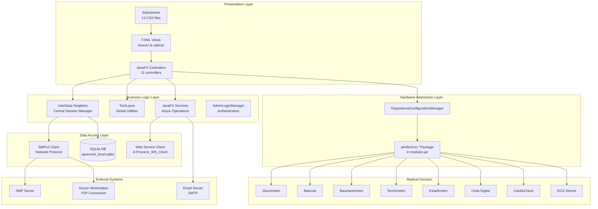
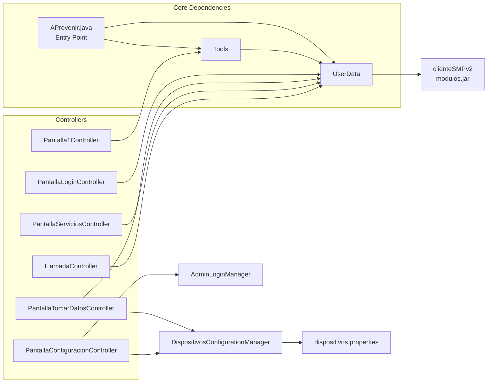

# System Architecture

> **Last Updated:** 2026-02-22
> **Document Version:** 1.0
> **Status:** Initial Documentation

---

## Table of Contents

1. [Executive Summary](#executive-summary)
2. [System Overview](#system-overview)
3. [Architecture Diagram](#architecture-diagram)
4. [Module Inventory](#module-inventory)
5. [Architectural Pattern Analysis](#architectural-pattern-analysis)
6. [Quality Assessment](#quality-assessment)
7. [Technical Debt Inventory](#technical-debt-inventory)
8. [Refactor vs. Rewrite Assessment](#refactor-vs-rewrite-assessment)

---

## Executive Summary

**A-Prevenir IDO** is a JavaFX-based e-health kiosk system developed by CICESE (Centro de Investigación Científica y de Educación Superior de Ensenada). The system enables patient self-service health measurements and telemedicine consultations with physicians.

| Attribute | Value |
|-----------|-------|
| **Primary Language** | Java 8 |
| **UI Framework** | JavaFX 8 with FXML |
| **Database** | SQLite 3 (local) |
| **Build System** | Apache Ant + NetBeans |
| **Codebase Size** | ~17,088 lines of Java code |
| **Total Controllers** | 11 |
| **Hardware Devices** | 8+ medical peripherals |
| **Architecture Style** | Modular Monolith with MVC pattern |

---

## System Overview

A-Prevenir is designed for deployment in health kiosks and medical workstations, providing:

1. **Patient Self-Service**: Users can measure vital signs without medical staff
2. **Telemedicine**: Video/audio consultations with remote physicians
3. **Health Assessments**: FINDRISC diabetes risk evaluation
4. **Data Management**: Local storage with server synchronization
5. **Reporting**: Email and CSV export of health measurements

### Deployment Modes

```
┌─────────────────────────────────────────────────────────────┐
│                    A-Prevenir System                        │
├─────────────────────────┬───────────────────────────────────┤
│   Kiosk Mode (1024x768) │   Cabina/Workstation Mode (Full)  │
│   - Public terminals    │   - Physician workstations        │
│   - Self-service        │   - Administrative access         │
│   - Touch-friendly UI   │   - Full configuration access     │
└─────────────────────────┴───────────────────────────────────┘
```

---

## Architecture Diagram



### Component Dependency Graph



---

## Module Inventory

### Core Application Modules

| Module | Location | Lines | Purpose | Dependencies |
|--------|----------|-------|---------|--------------|
| **APrevenir** | `src/aPrevenir/APrevenir.java` | ~300 | Application entry point, JavaFX initialization | Tools, UserData |
| **UserData** | `src/aPrevenir/Modelos/UserData.java` | 1,099 | Central session singleton, event hub | SMPv2, dao.* |
| **Tools** | `src/aPrevenir/Tools.java` | ~500 | Global utilities, stage management | UserData, vistas |
| **AdminLoginManager** | `src/aPrevenir/AdminLoginManager.java` | ~150 | JKS keystore authentication | Java Security |
| **DispositivosConfigurationManager** | `src/aPrevenir/DispositivosConfigurationManager.java` | ~200 | Device property configuration | Properties files |

### Controller Modules

| Controller | File | Responsibility |
|------------|------|----------------|
| **Pantalla1Controller** | `Controladores/Pantalla1Controller.java` | Welcome screen, idle detection |
| **PantallaLoginController** | `Controladores/PantallaLoginController.java` | User authentication |
| **PantallaServiciosController** | `Controladores/PantallaServiciosController.java` | Service selection menu |
| **PantallaTomarDatosController** | `Controladores/PantallaTomarDatosController.java` | Measurement collection |
| **LlamadaController** | `Controladores/LlamadaController.java` | Telemedicine video call |
| **ElegirMedicoController** | `Controladores/ElegirMedicoController.java` | Physician selection |
| **PantallaFINDRISCController** | `Controladores/PantallaFINDRISCController.java` | Diabetes risk assessment |
| **PantallaConfiguracionController** | `Controladores/PantallaConfiguracionController.java` | Admin configuration |
| **RegistrarUsuarioController** | `Controladores/RegistrarUsuarioController.java` | User registration |
| **RegistrarUsuarioLocalController** | `Controladores/RegistrarUsuarioLocalController.java` | Local user registration |
| **MostrarGraficasController** | `Controladores/MostrarGraficasController.java` | Health data visualization |

### Data Models

| Model | File | Purpose |
|-------|------|---------|
| **UserData** | `Modelos/UserData.java` | Session state holder |
| **Medico** | `Modelos/Medico.java` | Physician data |
| **DispositivosHabilitadosData** | `Modelos/DispositivosHabilitadosData.java` | Device enable states |
| **Pantallas** | `Modelos/Pantallas.java` | Screen enumeration |
| **PerifericoEnum** | `Modelos/PerifericoEnum.java` | Peripheral device types |
| **ServiceEnum** | `Modelos/ServiceEnum.java` | Service types |
| **MedicoEstadoEnum** | `Modelos/MedicoEstadoEnum.java` | Physician availability states |

### Service Modules

| Service | File | Purpose |
|---------|------|---------|
| **MedicionesEmailService** | `services/MedicionesEmailService.java` | Email measurement results |
| **ExportarDBService** | `services/ExportarDBService.java` | CSV/Excel data export |
| **ExportarEmailService** | `services/ExportarEmailService.java` | Email report generation |

### External Dependencies (JAR Libraries)

| Library | Version | Purpose |
|---------|---------|---------|
| **modulos.jar** | Custom | SMPv2 protocol, device drivers |
| **A-Prevenir_WS_Client_2021.jar** | Custom | Web service client |
| **sqlite-jdbc** | 3.30.1 | SQLite database driver |
| **jna** | 4.3.0 | Native device access |
| **gst1-java-core** | 1.2.0 | GStreamer multimedia |
| **poi** | 3.10.1 | Excel file generation |
| **commons-csv** | 1.7 | CSV export |
| **mail.jar** | - | SMTP email |
| **jzebra.jar** | - | Thermal printer support |

---

## Architectural Pattern Analysis

### Identified Patterns

#### 1. **Modular Monolith**
The application is a single deployable unit with logical module separation:
- Controllers handle UI logic
- Models hold data structures
- Services execute background operations
- External JARs provide network and hardware abstraction

#### 2. **Model-View-Controller (MVC)**
```
View (FXML)  ←→  Controller (Java)  ←→  Model (UserData, dao.*)
```

#### 3. **Singleton Pattern**
`UserData` acts as the central session singleton:
```java
// Pattern observed in UserData.java
private static UserData instance;
public static UserData getInstance() { ... }
```

#### 4. **Observer/Callback Pattern**
Event-driven communication via callbacks:
```java
// UserData implements callbacks from SMPv2
public void connectionStatusChanged() { ... }
public void dataAvailable() { ... }
public void doctorListUpdated() { ... }
```

#### 5. **Service/Task Pattern (JavaFX)**
Asynchronous operations use JavaFX Service:
```java
// MedicionesEmailService extends javafx.concurrent.Service
protected Task<Boolean> createTask() { ... }
```

### Architecture Classification

| Aspect | Classification | Notes |
|--------|---------------|-------|
| **Deployment** | Monolithic | Single JAR distribution |
| **Internal Structure** | Modular | Clear package separation |
| **Communication** | Event-driven + Direct | Callbacks + method calls |
| **UI Pattern** | MVC | FXML + Controller + Model |
| **Threading** | Reactive | JavaFX Platform.runLater() |

---

## Quality Assessment

### Cohesion Analysis

| Module | Cohesion Level | Assessment |
|--------|---------------|------------|
| **Controllers** | HIGH | Single responsibility per screen |
| **UserData** | LOW | God object - too many responsibilities |
| **Tools** | LOW | Utility grab-bag, mixed concerns |
| **Services** | HIGH | Focused async operations |
| **Models** | HIGH | Clean data structures |

### Coupling Analysis

| Coupling Type | Level | Evidence |
|--------------|-------|----------|
| **Controller ↔ UserData** | TIGHT | All controllers depend on UserData singleton |
| **Controller ↔ Tools** | TIGHT | Static method dependencies throughout |
| **Business ↔ Network** | MODERATE | SMPv2 abstracted in modulos.jar |
| **Business ↔ Hardware** | MODERATE | perifericos.* abstraction layer |

### Complexity Metrics

| File | Lines | Cyclomatic Complexity | Risk |
|------|-------|----------------------|------|
| `UserData.java` | 1,099 | HIGH | 🔴 Critical |
| `PantallaTomarDatosController.java` | ~800 | HIGH | 🔴 Critical |
| `LlamadaController.java` | ~600 | MODERATE | 🟡 Medium |
| `Tools.java` | ~500 | MODERATE | 🟡 Medium |
| Most Controllers | 200-400 | LOW | 🟢 Low |

### Quality Scorecard

| Criterion | Score (1-5) | Notes |
|-----------|-------------|-------|
| **Code Organization** | 3/5 | Good package structure, but god objects |
| **Separation of Concerns** | 2/5 | UserData and Tools violate SRP |
| **Testability** | 1/5 | No tests, tight coupling, singletons |
| **Documentation** | 1/5 | No architecture docs, sparse comments |
| **Error Handling** | 2/5 | Basic try-catch, limited recovery |
| **Security** | 2/5 | Credentials in properties files |
| **Maintainability** | 2/5 | Complex dependencies, hidden protocols |

**Overall Quality Score: 1.9/5** ⚠️

---

## Technical Debt Inventory

### Critical Issues (Must Fix)

| ID | Issue | Location | Impact | Effort |
|----|-------|----------|--------|--------|
| TD-001 | **God Object: UserData** | `Modelos/UserData.java` | Maintenance burden, untestable | HIGH |
| TD-002 | **No Test Coverage** | `/test/` (empty) | High regression risk | HIGH |
| TD-003 | **Hardcoded Credentials** | Properties files | Security vulnerability | LOW |
| TD-004 | **Hidden Protocol (SMPv2)** | `modulos.jar` | Debugging difficulty | MEDIUM |

### High Priority Issues (Should Fix)

| ID | Issue | Location | Impact | Effort |
|----|-------|----------|--------|--------|
| TD-005 | **Static Utility Abuse** | `Tools.java` | Tight coupling | MEDIUM |
| TD-006 | **Mixed UI/Business Logic** | Controllers | Testability | MEDIUM |
| TD-007 | **No Dependency Injection** | Throughout | Flexibility | HIGH |
| TD-008 | **Inconsistent Error Handling** | Multiple files | Reliability | MEDIUM |

### Medium Priority Issues (Nice to Fix)

| ID | Issue | Location | Impact | Effort |
|----|-------|----------|--------|--------|
| TD-009 | **No Logging Framework** | `ConsolePrintStream.java` | Debugging difficulty | LOW |
| TD-010 | **Spanish Code Comments** | Throughout | Onboarding barrier | LOW |
| TD-011 | **Outdated Dependencies** | `lib/` | Security, compatibility | MEDIUM |
| TD-012 | **No API Documentation** | Throughout | Knowledge transfer | MEDIUM |

---

## Refactor vs. Rewrite Assessment

### Factors Favoring Refactoring

| Factor | Weight | Notes |
|--------|--------|-------|
| Working system | HIGH | Production-deployed, functional |
| Modular structure | MEDIUM | Package separation exists |
| JavaFX MVC pattern | MEDIUM | Standard patterns in place |
| External abstractions | MEDIUM | Hardware/network in JARs |
| Business logic | HIGH | Domain knowledge encoded |

### Factors Favoring Rewrite

| Factor | Weight | Notes |
|--------|--------|-------|
| Java 8 / JavaFX 8 | MEDIUM | Aging technology stack |
| No tests | HIGH | High refactoring risk |
| God objects | HIGH | Deep coupling issues |
| Hidden dependencies | MEDIUM | modulos.jar black box |
| Security concerns | MEDIUM | Credential management |

### Recommendation Matrix

```
                    Code Quality
                    Low ←───────→ High
                    ┌─────────────────┐
Business Value  High│  REFACTOR ✓    │
                    │  (This system) │
                    ├─────────────────┤
                Low │  REWRITE       │
                    └─────────────────┘
```

### Final Recommendation: **INCREMENTAL REFACTORING**

**Rationale:**
1. System is functional and deployed
2. Core business logic is sound
3. Architecture problems are isolatable
4. Rewrite risk exceeds refactoring risk

**Suggested Refactoring Phases:**

1. **Phase 1: Add Test Infrastructure** (Effort: 2-3 weeks)
   - Add JUnit 5 + TestFX
   - Create tests for critical paths
   - Establish coverage baseline

2. **Phase 2: Break Up God Objects** (Effort: 4-6 weeks)
   - Extract session management from UserData
   - Extract network handling from UserData
   - Create proper service layer

3. **Phase 3: Introduce Dependency Injection** (Effort: 3-4 weeks)
   - Add DI framework (Guice or Spring)
   - Refactor controllers to accept dependencies
   - Improve testability

4. **Phase 4: Security Hardening** (Effort: 1-2 weeks)
   - Externalize credentials
   - Add encryption for sensitive data
   - Implement proper secrets management

5. **Phase 5: Modernization (Optional)** (Effort: 8-12 weeks)
   - Upgrade to Java 11+ / JavaFX 11+
   - Consider OpenJFX migration
   - Update deprecated dependencies

---

## See Also

- [Module Interactions](module-interactions.md) - Detailed workflow analysis
- [Design Decisions](design-decisions.md) - Architecture rationale
- [API Overview](api-overview.md) - Public interfaces
- [Hardware Integration](hardware-integration.md) - Device documentation
- [Testing Strategy](testing-strategy.md) - Test recommendations
- [Getting Started](getting-started.md) - Developer onboarding
- [Glossary](glossary.md) - Term definitions

---

*Document generated for A-Prevenir IDO architecture review*
