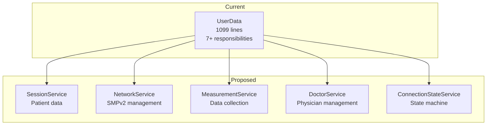
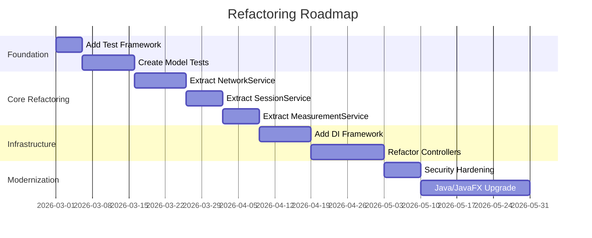

# Design Decisions

> **Last Updated:** 2026-02-22
> **Document Version:** 1.0
> **Related:** [Architecture Overview](architecture.md), [Module Interactions](module-interactions.md)

---

## Table of Contents

1. [Overview](#overview)
2. [Key Architecture Decisions](#key-architecture-decisions)
3. [Trade-off Analysis](#trade-off-analysis)
4. [Architectural Issues & Refactoring Candidates](#architectural-issues--refactoring-candidates)
5. [Refactoring Recommendations](#refactoring-recommendations)
6. [Migration Path](#migration-path)

---

## Overview

This document analyzes the architectural decisions observed in the A-Prevenir codebase, evaluates the trade-offs made, and provides actionable recommendations for improvement.

### Decision Record Format

Each decision is documented with:
- **Context**: Why the decision was needed
- **Decision**: What was chosen
- **Consequences**: Positive and negative outcomes
- **Assessment**: Current evaluation and recommendations

---

## Key Architecture Decisions

### ADR-001: JavaFX as UI Framework

| Aspect | Details |
|--------|---------|
| **Status** | Accepted (2017) |
| **Context** | Need for cross-platform desktop GUI with rich UI capabilities |
| **Decision** | Use JavaFX 8 with FXML for UI definition |
| **Alternatives Considered** | Swing, SWT, Web-based (Electron) |

**Consequences:**

| Positive | Negative |
|----------|----------|
| ✅ Rich UI components | ❌ JavaFX 8 now legacy |
| ✅ FXML separates design from logic | ❌ Limited mobile support |
| ✅ CSS styling support | ❌ OpenJFX migration needed for Java 11+ |
| ✅ Good multimedia support | ❌ Touch support requires customization |

**Assessment:**
- **Severity:** MEDIUM
- **Recommendation:** Plan migration to OpenJFX 17+ when upgrading Java version

---

### ADR-002: Singleton Pattern for Session Management (UserData)

| Aspect | Details |
|--------|---------|
| **Status** | Needs Review |
| **Context** | Central location to store patient session data accessible from all controllers |
| **Decision** | Implement UserData as singleton with static getInstance() |
| **Location** | `src/aPrevenir/Modelos/UserData.java` |

**Consequences:**

| Positive | Negative |
|----------|----------|
| ✅ Simple global access | ❌ **God object anti-pattern** |
| ✅ Single source of truth | ❌ Impossible to unit test |
| ✅ No DI framework needed | ❌ Hidden dependencies |
| | ❌ Tight coupling throughout |

**Assessment:**
- **Severity:** HIGH
- **Impact:** Major maintenance burden, testing impossible, refactoring risky
- **Effort:** HIGH
- **Recommendation:** Break into focused services with dependency injection

**Refactoring Example:**

```java
// CURRENT (Anti-pattern)
public class SomeController {
    public void doSomething() {
        UserData.getInstance().storeMeasurement(data);
    }
}

// RECOMMENDED
public class SomeController {
    private final SessionService sessionService;
    private final MeasurementService measurementService;

    public SomeController(SessionService session, MeasurementService measurements) {
        this.sessionService = session;
        this.measurementService = measurements;
    }

    public void doSomething() {
        measurementService.store(sessionService.getCurrentPatient(), data);
    }
}
```

---

### ADR-003: External JAR for Network Protocol (modulos.jar)

| Aspect | Details |
|--------|---------|
| **Status** | Accepted |
| **Context** | Network communication protocol (SMPv2) shared across multiple projects |
| **Decision** | Package network code in external modulos.jar |
| **Location** | `lib/modulos.jar` |

**Consequences:**

| Positive | Negative |
|----------|----------|
| ✅ Code reuse across projects | ❌ Black box - hard to debug |
| ✅ Single update point | ❌ Version management complexity |
| ✅ Separation of concerns | ❌ Source code not in this repo |
| | ❌ Callback interface coupling |

**Assessment:**
- **Severity:** MEDIUM
- **Impact:** Debugging network issues is difficult, protocol details hidden
- **Effort:** LOW (to document), HIGH (to replace)
- **Recommendation:** Document the SMPv2 protocol interface; consider open-sourcing or documenting modulos.jar

---

### ADR-004: Hardware Abstraction via perifericos.* Package

| Aspect | Details |
|--------|---------|
| **Status** | Accepted |
| **Context** | Multiple medical devices with different protocols |
| **Decision** | Abstract all devices behind perifericos.* classes in modulos.jar |
| **Location** | `lib/modulos.jar` (perifericos.* package) |

**Consequences:**

| Positive | Negative |
|----------|----------|
| ✅ Consistent device API | ❌ Source code not accessible |
| ✅ Device-agnostic controller code | ❌ Adding new devices requires JAR update |
| ✅ Serial port abstraction | ❌ Testing requires physical devices |

**Assessment:**
- **Severity:** MEDIUM
- **Impact:** Good abstraction but limited flexibility
- **Effort:** MEDIUM
- **Recommendation:** Create mock device implementations for testing; document device protocol specs

---

### ADR-005: Properties Files for Device Configuration

| Aspect | Details |
|--------|---------|
| **Status** | Accepted |
| **Context** | Each deployment may have different device configurations |
| **Decision** | Use .properties files for device serial numbers, ports, calibration |
| **Location** | `dispositivos.properties`, `res/*_config.properties` |

**Consequences:**

| Positive | Negative |
|----------|----------|
| ✅ Easy deployment customization | ❌ No validation on load |
| ✅ No recompilation needed | ❌ Typos cause runtime failures |
| ✅ Human-readable format | ❌ No schema enforcement |

**Assessment:**
- **Severity:** LOW
- **Recommendation:** Add configuration validation on startup; consider YAML or JSON for structured config

---

### ADR-006: SQLite for Local Data Storage

| Aspect | Details |
|--------|---------|
| **Status** | Accepted |
| **Context** | Need offline data storage for measurements when server unavailable |
| **Decision** | Use SQLite embedded database |
| **Location** | `db/aprevenir_local.sqlite` |

**Consequences:**

| Positive | Negative |
|----------|----------|
| ✅ Zero configuration | ❌ Single-file, no concurrent access |
| ✅ Offline capable | ❌ Limited scalability |
| ✅ Portable | ❌ No encryption by default |
| ✅ SQL standard | |

**Assessment:**
- **Severity:** LOW
- **Recommendation:** Good choice for kiosk use case; consider SQLCipher if data encryption needed

---

### ADR-007: Static Utility Class (Tools.java)

| Aspect | Details |
|--------|---------|
| **Status** | Needs Review |
| **Context** | Common operations needed across controllers |
| **Decision** | Centralize utilities in static Tools class |
| **Location** | `src/aPrevenir/Tools.java` |

**Consequences:**

| Positive | Negative |
|----------|----------|
| ✅ Easy access from anywhere | ❌ Global mutable state |
| ✅ No instantiation needed | ❌ Hidden dependencies |
| | ❌ Difficult to mock in tests |
| | ❌ Mixed responsibilities |

**Assessment:**
- **Severity:** MEDIUM
- **Impact:** Testing difficulty, unclear dependencies
- **Effort:** MEDIUM
- **Recommendation:** Split into focused utility classes; inject where possible

---

### ADR-008: JavaFX Service for Background Operations

| Aspect | Details |
|--------|---------|
| **Status** | Accepted (Good Practice) |
| **Context** | Need async operations without blocking UI |
| **Decision** | Use JavaFX Service/Task pattern |
| **Location** | `src/aPrevenir/services/*.java` |

**Consequences:**

| Positive | Negative |
|----------|----------|
| ✅ Proper thread management | ❌ Verbose boilerplate |
| ✅ Built-in progress tracking | |
| ✅ Automatic UI thread callback | |
| ✅ Cancellation support | |

**Assessment:**
- **Severity:** N/A (Good decision)
- **Recommendation:** Continue using this pattern; document service lifecycle

---

### ADR-009: JKS Keystore for Admin Authentication

| Aspect | Details |
|--------|---------|
| **Status** | Accepted |
| **Context** | Need to protect admin configuration from unauthorized access |
| **Decision** | Store admin password hash in JKS keystore |
| **Location** | `res/aprevenir_llave.jks` |

**Consequences:**

| Positive | Negative |
|----------|----------|
| ✅ Better than plaintext | ❌ JKS is deprecated format |
| ✅ Java native support | ❌ Password still needed to open keystore |
| | ❌ Limited to single password |

**Assessment:**
- **Severity:** LOW
- **Recommendation:** Migrate to PKCS12 format; consider more robust auth for production

---

### ADR-010: GStreamer for Multimedia

| Aspect | Details |
|--------|---------|
| **Status** | Accepted |
| **Context** | Need video/audio streaming for telemedicine calls |
| **Decision** | Use GStreamer via gst1-java-core bindings |
| **Location** | `lib/gst1-java-core-1.2.0.jar` |

**Consequences:**

| Positive | Negative |
|----------|----------|
| ✅ Powerful multimedia framework | ❌ Native library dependency |
| ✅ Good codec support | ❌ Platform-specific setup |
| ✅ Low latency streaming | ❌ Complex debugging |

**Assessment:**
- **Severity:** LOW
- **Recommendation:** Document GStreamer installation requirements; consider WebRTC for future versions

---

## Trade-off Analysis

### Architecture Trade-offs Summary

| Decision Area | Chosen Approach | Alternative | Why This Choice |
|--------------|-----------------|-------------|-----------------|
| **State Management** | Singleton | DI Container | Simplicity over testability |
| **UI Framework** | JavaFX | Web-based | Native feel, offline capability |
| **Network Protocol** | Custom SMPv2 | REST/WebSocket | Legacy integration, P2P support |
| **Data Storage** | SQLite | Remote-only | Offline operation requirement |
| **Device Access** | JNA + Serial | USB HID | Device manufacturer protocols |
| **Build System** | Ant | Maven/Gradle | NetBeans integration |

### Simplicity vs. Flexibility

```
Simplicity ◄─────────────────────────────────► Flexibility
     │                                              │
     │  ┌─────────────────────────────┐            │
     │  │ Current A-Prevenir Position │            │
     │  │         ◄────●               │            │
     │  └─────────────────────────────┘            │
     │                                              │
   Singletons                              Dependency Injection
   Static Utils                            Service Interfaces
   Properties Files                        Configuration Services
   Direct Calls                            Event Bus
```

**Observation:** The codebase prioritized simplicity during initial development, which was appropriate for a research project. For long-term maintenance and testing, the balance should shift toward flexibility.

---

## Architectural Issues & Refactoring Candidates

### Issue Priority Matrix

| ID | Issue | Severity | Impact | Effort | Priority |
|----|-------|----------|--------|--------|----------|
| ISS-001 | UserData God Object | HIGH | Maintenance, Testing | HIGH | P1 |
| ISS-002 | No Unit Tests | HIGH | Regression Risk | MEDIUM | P1 |
| ISS-003 | Tools Static Abuse | MEDIUM | Testing | MEDIUM | P2 |
| ISS-004 | Hardcoded Credentials | MEDIUM | Security | LOW | P2 |
| ISS-005 | No DI Framework | MEDIUM | Flexibility | HIGH | P3 |
| ISS-006 | Mixed UI/Business Logic | MEDIUM | Testability | MEDIUM | P3 |
| ISS-007 | Java 8 / JavaFX 8 | LOW | Future Compat | HIGH | P4 |
| ISS-008 | No Logging Framework | LOW | Debugging | LOW | P4 |

### ISS-001: UserData God Object (Critical)

**Location:** `src/aPrevenir/Modelos/UserData.java:1-1099`

**Current Responsibilities (Too Many):**
1. Patient session data
2. SMPv2 client lifecycle
3. Network connection state
4. Measurement storage
5. Doctor list management
6. Callback event handling
7. Multimedia state tracking

**Refactoring Strategy:**



**Recommended Steps:**
1. Extract `NetworkService` - SMPv2 client management
2. Extract `SessionService` - Patient session data
3. Extract `MeasurementService` - Measurement operations
4. Extract `DoctorService` - Physician listing/selection
5. Implement proper event bus for callbacks

---

### ISS-002: No Unit Tests (Critical)

**Location:** `/test/` (empty directory)

**Impact:**
- Any refactoring carries high regression risk
- Bug fixes cannot be verified automatically
- No documentation of expected behavior

**Recommended Test Strategy:**
1. Add JUnit 5 dependency
2. Start with model classes (pure logic, easy to test)
3. Add TestFX for controller integration tests
4. Create device mocks for hardware testing

See [Testing Strategy](testing-strategy.md) for detailed recommendations.

---

### ISS-003: Tools Static Abuse (Medium)

**Location:** `src/aPrevenir/Tools.java`

**Problems:**
- Global mutable state (current stage, timers)
- Cannot be mocked for testing
- Hidden dependencies in controllers

**Refactoring:**

```java
// CURRENT
public class Tools {
    private static Stage stage;
    private static Timer idleTimer;

    public static void changeView(Pantallas view) { ... }
    public static void showAlert(String msg) { ... }
}

// PROPOSED
public class NavigationService {
    private final Stage stage;

    public NavigationService(Stage stage) {
        this.stage = stage;
    }

    public void navigateTo(Pantallas view) { ... }
}

public class AlertService {
    public void showInfo(String message) { ... }
    public void showError(String message) { ... }
}
```

---

### ISS-004: Hardcoded Credentials (Medium)

**Locations:**
- Email credentials in properties/code
- Server IP in `server.ip` file
- Database path hardcoded

**Recommendations:**
1. Use environment variables for sensitive data
2. Implement secrets management (e.g., encrypted config)
3. Never commit credentials to version control

---

### ISS-006: Mixed UI/Business Logic (Medium)

**Example Location:** `PantallaTomarDatosController.java`

**Problem:** Controllers contain both UI logic and business rules

```java
// CURRENT - Business logic mixed with UI
public class PantallaTomarDatosController {
    public void onMeasurementReceived(float value) {
        // Business logic
        if (value < normalRange.min || value > normalRange.max) {
            warning = true;
        }
        measurement.setValue(value);

        // UI logic
        label.setText(String.format("%.1f", value));
        if (warning) {
            label.setStyle("-fx-text-fill: red;");
        }
    }
}

// PROPOSED - Separated concerns
public class MeasurementValidator {
    public ValidationResult validate(float value, NormalRange range) {
        // Pure business logic, testable
    }
}

public class PantallaTomarDatosController {
    private final MeasurementValidator validator;

    public void onMeasurementReceived(float value) {
        ValidationResult result = validator.validate(value, range);
        updateUI(result);
    }
}
```

---

## Refactoring Recommendations

### Recommended Refactoring Order



### Quick Wins (Low Effort, High Value)

| Change | Location | Effort | Impact |
|--------|----------|--------|--------|
| Add SLF4J logging | Throughout | 1 day | Better debugging |
| Extract config validation | `DispositivosConfigurationManager` | 2 days | Fewer runtime errors |
| Document SMPv2 callbacks | `UserData.java` | 1 day | Knowledge transfer |
| Add .gitignore for credentials | Root | 1 hour | Security |

### Medium-Term Improvements

| Change | Effort | Impact |
|--------|--------|--------|
| Add JUnit + TestFX | 1-2 weeks | Enable safe refactoring |
| Extract NetworkService | 2 weeks | Reduce UserData complexity |
| Implement event bus | 1 week | Decouple callbacks |
| Add configuration schema | 1 week | Deployment reliability |

### Long-Term Modernization

| Change | Effort | Impact |
|--------|--------|--------|
| Migrate to Java 11+ | 3-4 weeks | Modern language features |
| Migrate to OpenJFX | 2-3 weeks | Future compatibility |
| Implement full DI | 4-6 weeks | Testability, flexibility |
| Add CI/CD pipeline | 1-2 weeks | Quality assurance |

---

## Migration Path

### Phase 1: Stabilization (Weeks 1-4)

**Goal:** Enable safe refactoring without breaking functionality

1. **Week 1:** Set up test infrastructure
   - Add JUnit 5, Mockito, TestFX dependencies
   - Create test directory structure
   - Write first model tests

2. **Week 2-3:** Document and test critical paths
   - Document SMPv2 callback contract
   - Add integration tests for login flow
   - Add tests for measurement workflow

3. **Week 4:** Quick wins
   - Add logging framework
   - Add configuration validation
   - Document all public APIs

### Phase 2: Core Refactoring (Weeks 5-12)

**Goal:** Break up god objects and reduce coupling

1. **Weeks 5-6:** Extract NetworkService
   - Move SMPv2 client management out of UserData
   - Create clean interface for network operations
   - Add tests for network service

2. **Weeks 7-8:** Extract SessionService and MeasurementService
   - Separate patient session from measurements
   - Create service interfaces
   - Update controllers to use new services

3. **Weeks 9-10:** Introduce DI framework
   - Add Google Guice or similar
   - Refactor controller instantiation
   - Remove singleton access patterns

4. **Weeks 11-12:** Cleanup and stabilization
   - Remove deprecated code paths
   - Update documentation
   - Full regression testing

### Phase 3: Modernization (Weeks 13-20)

**Goal:** Update technology stack for long-term maintainability

1. **Weeks 13-16:** Java/JavaFX upgrade
   - Upgrade to Java 17 LTS
   - Migrate to OpenJFX
   - Update all dependencies

2. **Weeks 17-18:** Security hardening
   - Implement proper secrets management
   - Add data encryption
   - Security audit

3. **Weeks 19-20:** CI/CD and documentation
   - Set up automated builds
   - Add code quality checks
   - Complete documentation

---

## Decision Log Template

For future architectural decisions, use this template:

```markdown
### ADR-XXX: [Title]

| Aspect | Details |
|--------|---------|
| **Status** | Proposed / Accepted / Deprecated / Superseded |
| **Date** | YYYY-MM-DD |
| **Context** | Why is this decision needed? |
| **Decision** | What was decided? |
| **Alternatives** | What else was considered? |
| **Consequences** | What are the positive and negative outcomes? |
```

---

## See Also

- [Architecture Overview](architecture.md) - System structure
- [Module Interactions](module-interactions.md) - How modules communicate
- [Testing Strategy](testing-strategy.md) - Test recommendations
- [Getting Started](getting-started.md) - Developer setup

---

*Document generated for A-Prevenir IDO architecture review*
