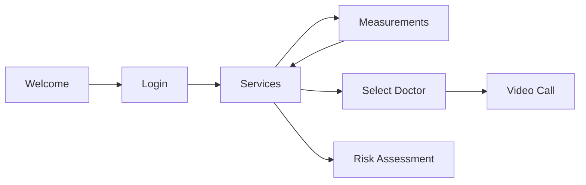

# Getting Started Guide

> **Last Updated:** 2026-02-22
> **Document Version:** 1.0
> **Audience:** New developers joining the project

---

## Table of Contents

1. [Introduction](#introduction)
2. [Prerequisites](#prerequisites)
3. [Development Environment Setup](#development-environment-setup)
4. [Building the Project](#building-the-project)
5. [Running the Application](#running-the-application)
6. [Project Structure Overview](#project-structure-overview)
7. [Key Concepts](#key-concepts)
8. [Common Tasks](#common-tasks)
9. [Troubleshooting](#troubleshooting)
10. [Next Steps](#next-steps)

---

## Introduction

Welcome to the A-Prevenir IDO development team! This guide will help you set up your development environment and understand the codebase.

### What is A-Prevenir?

A-Prevenir is an e-health kiosk system that allows patients to:
- Measure vital signs using connected medical devices
- Consult with physicians via telemedicine
- Complete health risk assessments (FINDRISC diabetes test)
- Track health data over time

### Technology Stack

| Component | Technology |
|-----------|------------|
| **Language** | Java 8 |
| **UI Framework** | JavaFX 8 with FXML |
| **Database** | SQLite 3 |
| **Build System** | Apache Ant |
| **IDE** | NetBeans (primary), IntelliJ IDEA, Eclipse |
| **Multimedia** | GStreamer (for video calls) |

---

## Prerequisites

### Required Software

| Software | Version | Download |
|----------|---------|----------|
| **JDK** | 8 (1.8.x) | [Oracle JDK 8](https://www.oracle.com/java/technologies/javase/javase8-archive-downloads.html) or [OpenJDK 8](https://adoptium.net/) |
| **Apache Ant** | 1.10.x | [Apache Ant](https://ant.apache.org/bindownload.cgi) |
| **NetBeans** | 8.2+ | [NetBeans](https://netbeans.apache.org/download/) |
| **Git** | 2.x | [Git](https://git-scm.com/downloads) |

### Optional Software

| Software | Purpose |
|----------|---------|
| **GStreamer** | Video streaming for telemedicine calls |
| **FTDI Drivers** | USB-to-Serial device communication |
| **SQLite Browser** | Database inspection |

### System Requirements

| Requirement | Minimum | Recommended |
|-------------|---------|-------------|
| **OS** | Windows 10, Linux | Windows 10/11 |
| **RAM** | 4 GB | 8 GB |
| **Disk Space** | 1 GB | 2 GB |
| **Display** | 1024x768 | 1920x1080 |

---

## Development Environment Setup

### Step 1: Install JDK 8

**Windows:**
1. Download JDK 8 from Oracle or Adoptium
2. Run the installer
3. Set `JAVA_HOME` environment variable:
   ```cmd
   setx JAVA_HOME "C:\Program Files\Java\jdk1.8.0_xxx"
   setx PATH "%PATH%;%JAVA_HOME%\bin"
   ```

**Linux:**
```bash
sudo apt update
sudo apt install openjdk-8-jdk
export JAVA_HOME=/usr/lib/jvm/java-8-openjdk-amd64
echo 'export JAVA_HOME=/usr/lib/jvm/java-8-openjdk-amd64' >> ~/.bashrc
```

**Verify installation:**
```bash
java -version
# Should show: java version "1.8.0_xxx"
```

### Step 2: Install Apache Ant

**Windows:**
1. Download Ant from apache.org
2. Extract to `C:\apache-ant`
3. Set environment variables:
   ```cmd
   setx ANT_HOME "C:\apache-ant"
   setx PATH "%PATH%;%ANT_HOME%\bin"
   ```

**Linux:**
```bash
sudo apt install ant
```

**Verify installation:**
```bash
ant -version
# Should show: Apache Ant(TM) version 1.10.x
```

### Step 3: Clone the Repository

```bash
git clone <repository-url> A-Prevenir-IDO
cd A-Prevenir-IDO
```

### Step 4: Set Up IDE

#### NetBeans (Recommended)

1. Open NetBeans
2. File → Open Project
3. Navigate to `A-Prevenir-IDO` directory
4. Select the project (has NetBeans icon)
5. Click "Open Project"

#### IntelliJ IDEA

1. Open IntelliJ IDEA
2. File → New → Project from Existing Sources
3. Select `A-Prevenir-IDO` directory
4. Choose "Import project from external model" → Ant
5. Follow the wizard

### Step 5: Configure Project Libraries

Ensure all JAR files in `lib/` are added to the project classpath:

**In NetBeans:**
1. Right-click project → Properties
2. Libraries → Add JAR/Folder
3. Add all JARs from `lib/` directory

**Key Libraries:**
- `modulos.jar` - Network and device drivers
- `sqlite-jdbc-3.30.1.jar` - Database driver
- `gst1-java-core-1.2.0.jar` - Video streaming
- `jna-4.3.0.jar` - Native access

---

## Building the Project

### Using Ant (Command Line)

```bash
# Navigate to project root
cd A-Prevenir-IDO

# Clean and build
ant clean
ant jar

# Build creates: dist/A-Prevenir-IDO.jar
```

### Using NetBeans

1. Right-click project
2. Select "Clean and Build"
3. Output appears in `dist/` directory

### Build Outputs

```
dist/
├── A-Prevenir-IDO.jar      # Main application JAR
├── lib/                     # Copied dependencies
└── run/                     # Runtime resources
```

### Build Troubleshooting

| Issue | Solution |
|-------|----------|
| "javafx not found" | Ensure JDK 8 (includes JavaFX) |
| "Cannot find symbol" | Check library paths in project |
| "Ant build failed" | Run `ant -v` for verbose output |

---

## Running the Application

### From Command Line

```bash
# Standard mode (Kiosk, 1024x768)
java -jar dist/A-Prevenir-IDO.jar

# Demo mode (simulated devices)
java -jar dist/A-Prevenir-IDO.jar demo

# Workstation mode (full screen)
java -jar dist/A-Prevenir-IDO.jar cabina

# Demo + Workstation mode
java -jar dist/A-Prevenir-IDO.jar demo cabina
```

### From NetBeans

1. Right-click project
2. Select "Run"
3. Configure run arguments in Project Properties → Run

### Using Batch Files (Windows)

```cmd
# Run kiosk mode
aPrevenirKiosco.bat

# Run with virtual keyboard
aPrevenirKiosco_VK.bat
```

### First Run Checklist

- [ ] Application window appears
- [ ] Welcome screen displays correctly
- [ ] Touch/click on screen navigates to login
- [ ] Check `logs/` for any startup errors

---

## Project Structure Overview

```
A-Prevenir-IDO/
├── src/aPrevenir/                 # Main source code
│   ├── APrevenir.java             # Entry point
│   ├── Controladores/             # UI Controllers (11 files)
│   ├── Modelos/                   # Data models
│   ├── Vistas/                    # FXML UI definitions
│   │   ├── kiosco/                # Kiosk mode screens
│   │   └── cabina/                # Workstation screens
│   ├── services/                  # Background services
│   ├── stylesheets/               # CSS styling
│   ├── Images/                    # UI images
│   └── Tools.java                 # Utility methods
│
├── lib/                           # JAR dependencies
├── db/                            # SQLite database
├── res/                           # Resources (certs, keystores)
├── logs/                          # Application logs
├── exportar/                      # Exported data files
│
├── Glucometro/                    # Device configurations
├── BasculaPelicano/
├── baumanometroAD/
├── TermometroPelicano/
├── Estadimetro/
├── cintadigital/
├── Mlipidos/
│
├── build.xml                      # Ant build script
├── dispositivos.properties        # Main device config
├── server.ip                      # Server IP address
└── docs/                          # Documentation (you are here!)
```

### Key Files to Know

| File | Purpose |
|------|---------|
| `APrevenir.java` | Application entry point |
| `UserData.java` | Central session singleton (read this first!) |
| `Tools.java` | Global utilities and navigation |
| `dispositivos.properties` | Device enable/disable flags |
| `server.ip` | Server connection address |

---

## Key Concepts

### 1. Application Modes

| Mode | Resolution | Use Case |
|------|------------|----------|
| **Kiosk** | 1024x768 | Public self-service terminals |
| **Cabina** | Full Screen | Physician workstations |
| **Demo** | Any | Testing without devices |

### 2. Screen Navigation



Navigation is handled by `Tools.changeView(Pantallas.SCREEN_NAME)`.

### 3. Singleton Pattern (UserData)

All session data flows through `UserData.getInstance()`:

```java
// Get current patient
Paciente patient = UserData.getInstance().getPaciente();

// Store a measurement
UserData.getInstance().storeMeasurement("temperatura", 36.5f);

// Check connection status
if (UserData.getInstance().isConnectedToServer()) {
    // Online operations
}
```

### 4. Controller Pattern

Each screen has:
- **FXML file**: `Vistas/kiosco/PantallaXxx.fxml` - UI layout
- **Controller**: `Controladores/PantallaXxxController.java` - Logic

```java
public class ExampleController implements Initializable {

    @FXML private Label titleLabel;
    @FXML private Button actionButton;

    @Override
    public void initialize(URL url, ResourceBundle rb) {
        // Called when FXML loads
    }

    @FXML
    private void onActionButtonClick(ActionEvent event) {
        // Handle button click
    }
}
```

### 5. Device Integration

Devices are accessed through the `perifericos.*` package in `modulos.jar`:

```java
// Example: Initialize glucometer
glucometro device = new glucometro(config);
device.setCallback((value) -> {
    Platform.runLater(() -> {
        displayReading(value);
    });
});
device.connect();
device.startReading();
```

---

## Common Tasks

### Adding a New Screen

1. **Create FXML:**
   ```xml
   <!-- src/aPrevenir/Vistas/kiosco/PantallaNewScreen.fxml -->
   <AnchorPane fx:controller="aPrevenir.Controladores.PantallaNewScreenController">
       <!-- UI components -->
   </AnchorPane>
   ```

2. **Create Controller:**
   ```java
   // src/aPrevenir/Controladores/PantallaNewScreenController.java
   public class PantallaNewScreenController implements Initializable {
       @Override
       public void initialize(URL url, ResourceBundle rb) {
           // Initialize
       }
   }
   ```

3. **Add to Pantallas enum:**
   ```java
   // src/aPrevenir/Modelos/Pantallas.java
   public enum Pantallas {
       // ... existing screens
       NEW_SCREEN
   }
   ```

4. **Update vistas.java:**
   ```java
   // Add FXML path for new screen
   ```

5. **Navigate to new screen:**
   ```java
   Tools.changeView(Pantallas.NEW_SCREEN);
   ```

### Modifying Device Configuration

1. Edit `dispositivos.properties`:
   ```properties
   # Enable/disable a device
   glucometroHabilitado=1  # 1=enabled, 0=disabled
   ```

2. For device-specific settings, edit the device's folder:
   ```
   Glucometro/dispositivos.properties
   ```

### Adding a New Measurement Type

1. Update `Medicion` model (in external JAR or local wrapper)
2. Add validation in `PantallaTomarDatosController`
3. Update export formats in `ExportarDBService`
4. Add to UI in `PantallaTomarDatos.fxml`

### Debugging Network Issues

1. Check `server.ip` contains correct server address
2. Review logs in `logs/` directory
3. Verify firewall allows connections
4. Use demo mode to isolate network vs device issues

### Viewing the Database

1. Install SQLite Browser
2. Open `db/aprevenir_local.sqlite`
3. Browse tables: patients, measurements, FINDRISC results

---

## Troubleshooting

### Application Won't Start

| Symptom | Cause | Solution |
|---------|-------|----------|
| "java not found" | JDK not installed | Install JDK 8 |
| "JavaFX error" | Wrong JDK version | Use JDK 8 (includes JavaFX) |
| White/blank screen | FXML loading error | Check logs, verify FXML paths |
| "No devices found" | Demo mode needed | Run with `demo` argument |

### Build Errors

| Error | Cause | Solution |
|-------|-------|----------|
| "Cannot find modulos.jar" | Missing library | Add `lib/modulos.jar` to classpath |
| "Package not found" | Missing dependency | Check all JARs in `lib/` |
| "Incompatible version" | JDK mismatch | Use JDK 8 |

### Runtime Errors

| Error | Cause | Solution |
|-------|-------|----------|
| "Connection refused" | Server unavailable | Check `server.ip`, network |
| "Device timeout" | Device not connected | Use demo mode or connect device |
| "Database locked" | File in use | Close other connections |

### Log Files

Logs are stored in `logs/` with timestamp filenames:
```
logs/2026-02-22-10-30-45_log.txt
```

**What to look for:**
- Exception stack traces
- "ERROR" or "WARN" messages
- Connection status changes
- Device initialization failures

---

## Next Steps

### Recommended Reading Order

1. **[Architecture Overview](architecture.md)** - Understand system structure
2. **[Module Interactions](module-interactions.md)** - Learn workflows
3. **[API Overview](api-overview.md)** - Reference for development
4. **[Hardware Integration](hardware-integration.md)** - Device details
5. **[Design Decisions](design-decisions.md)** - Why things are the way they are
6. **[Testing Strategy](testing-strategy.md)** - How to add tests
7. **[Glossary](glossary.md)** - Term definitions

### First Tasks for New Developers

1. **Run the app in demo mode** - Explore all screens
2. **Read UserData.java** - Understand the central singleton
3. **Trace a workflow** - Follow login from UI to database
4. **Make a small change** - Modify a label, rebuild, verify
5. **Review the logs** - Understand what gets logged

### Getting Help

- **Code questions:** Review inline comments (Spanish)
- **Architecture questions:** See documentation in `docs/`
- **Bug reports:** Check `logs/` first, then report with log excerpt

### Contributing Guidelines

1. Follow existing code style
2. Add comments for complex logic
3. Test in demo mode before committing
4. Update documentation for significant changes
5. Create meaningful commit messages

---

## Quick Reference Card

### Run Commands

```bash
java -jar dist/A-Prevenir-IDO.jar          # Normal
java -jar dist/A-Prevenir-IDO.jar demo     # Demo mode
java -jar dist/A-Prevenir-IDO.jar cabina   # Workstation
```

### Key Classes

| Class | Purpose |
|-------|---------|
| `APrevenir` | Entry point |
| `UserData` | Session singleton |
| `Tools` | Utilities, navigation |
| `DispositivosConfigurationManager` | Device config |

### Key Files

| File | Purpose |
|------|---------|
| `dispositivos.properties` | Device enable flags |
| `server.ip` | Server address |
| `db/aprevenir_local.sqlite` | Local database |
| `logs/*.txt` | Application logs |

### Navigation

```java
Tools.changeView(Pantallas.SCREEN_NAME);
```

### Session Access

```java
UserData.getInstance().getPaciente();
UserData.getInstance().storeMeasurement(type, value);
```

---

## See Also

- [Architecture Overview](architecture.md)
- [Module Interactions](module-interactions.md)
- [API Overview](api-overview.md)
- [Glossary](glossary.md)

---

*Welcome to the team! 🏥*

*Document generated for A-Prevenir IDO architecture review*
