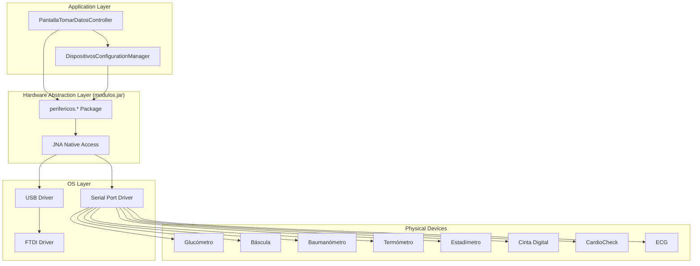
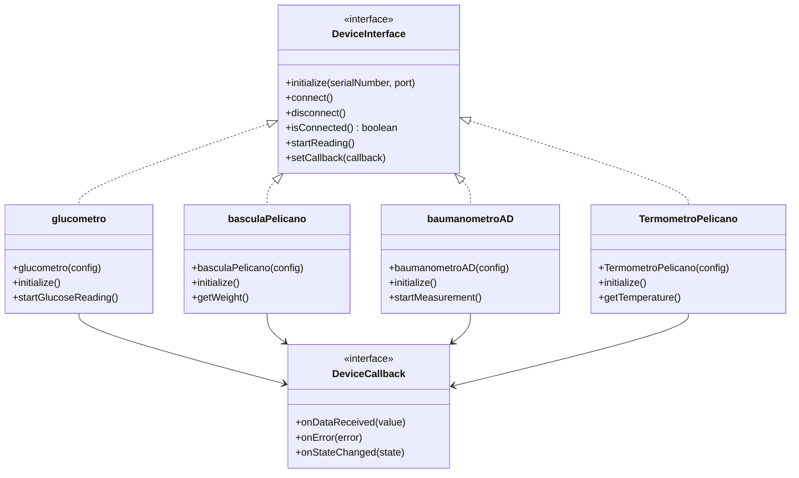
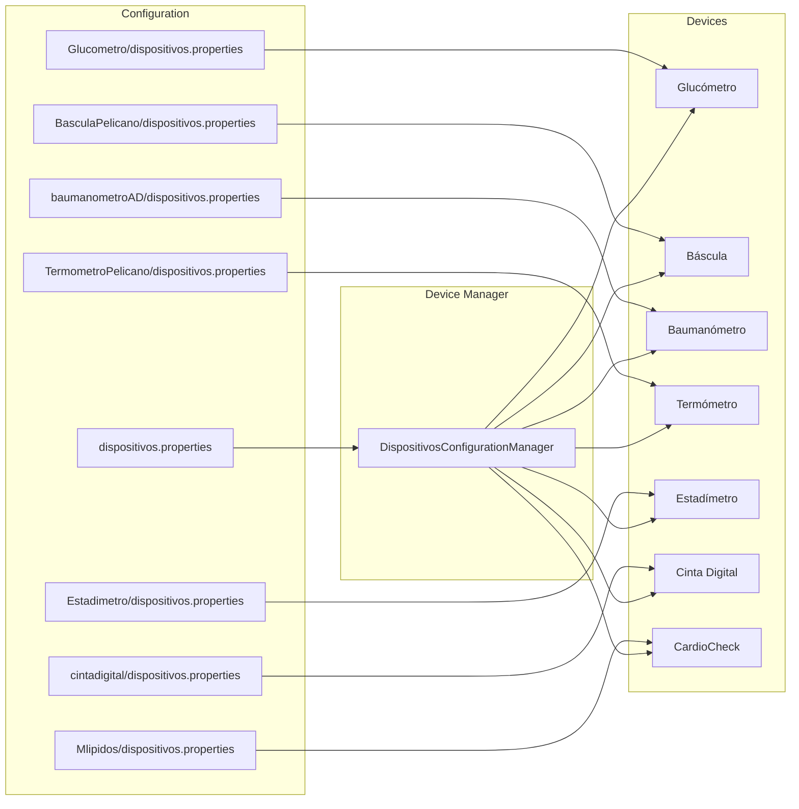
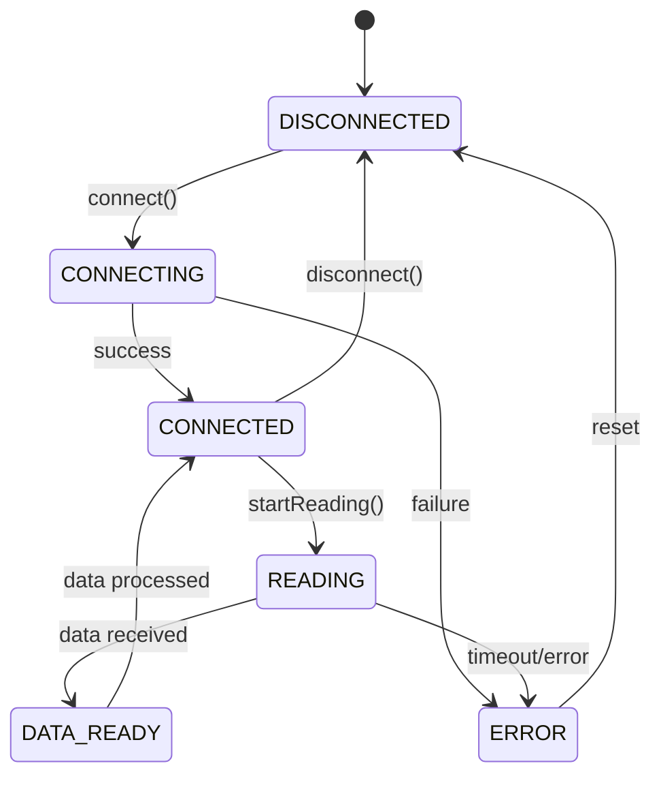

# Hardware Integration

> **Last Updated:** 2026-02-22
> **Document Version:** 1.0
> **Related:** [Architecture Overview](architecture.md), [API Overview](api-overview.md)

---

## Table of Contents

1. [Overview](#overview)
2. [Supported Medical Devices](#supported-medical-devices)
3. [Hardware Abstraction Layer](#hardware-abstraction-layer)
4. [Device Integration Matrix](#device-integration-matrix)
5. [Communication Protocols](#communication-protocols)
6. [Configuration & Calibration](#configuration--calibration)
7. [Failure Modes & Recovery](#failure-modes--recovery)
8. [Adding New Devices](#adding-new-devices)

---

## Overview

A-Prevenir integrates with multiple medical measurement devices to collect patient vital signs and health metrics. All device communication is handled through the `perifericos.*` package in `modulos.jar`, providing a hardware abstraction layer.

### Device Communication Architecture



---

## Supported Medical Devices

### Device Inventory

| Device | Spanish Name | Model/Variant | Interface | Measurements |
|--------|--------------|---------------|-----------|--------------|
| **Blood Glucose Meter** | Glucómetro | USB-based | USB Serial | Blood glucose (mg/dL) |
| **Digital Scale** | Báscula | Pelicano / AD | RS-232 Serial | Weight (kg), Body composition |
| **Blood Pressure Monitor** | Baumanómetro | AD variant | RS-232 Serial | Systolic/Diastolic (mmHg), Heart rate |
| **Digital Thermometer** | Termómetro | Pelicano | RS-232 Serial | Temperature (°C) |
| **Stadiometer** | Estadímetro | Pelicano | RS-232 Serial | Height (cm), Auto-calculated BMI |
| **Digital Tape** | Cinta Digital | - | RS-232 Serial | Waist circumference (cm) |
| **Lipid Analyzer** | CardioCheck | CardioCheck PA | RS-232 Serial | TC, TG, HDL, LDL, TC/HDL ratio |
| **ECG Device** | ECG | - | RS-232 Serial | Electrocardiogram data |

### Device Details

#### 1. Glucómetro (Blood Glucose Meter)

| Attribute | Value |
|-----------|-------|
| **Class** | `perifericos.glucometro` |
| **Interface** | USB (Virtual Serial Port) |
| **Config File** | `Glucometro/dispositivos.properties` |
| **ID File** | `Glucometro/gluc_USB_identifier.txt` |
| **Measurement** | Blood glucose |
| **Unit** | mg/dL |
| **Normal Range** | 70-100 (fasting) |

**Configuration:**
```properties
# Glucometro/dispositivos.properties
glucometroSerialNumber=DBG6314CY
glucometroHabilitado=1
```

**Measurement Protocol:**
1. Device detects sample insertion
2. Countdown displayed (typically 5 seconds)
3. Result transmitted via USB serial
4. Software validates and displays result

---

#### 2. Báscula (Digital Scale)

| Attribute | Value |
|-----------|-------|
| **Class** | `perifericos.basculaPelicano` / `perifericos.basculaAD` |
| **Interface** | RS-232 Serial |
| **Config File** | `BasculaPelicano/dispositivos.properties` |
| **Measurement** | Weight, Body composition |
| **Unit** | kg |
| **Resolution** | 0.1 kg |

**Variants:**
- **Pelicano**: Standard scale
- **AD (basculaAD)**: Advanced scale with body composition

**Configuration:**
```properties
# BasculaPelicano/dispositivos.properties
basculaID=AD00003F
basculaHabilitado=1
```

---

#### 3. Baumanómetro (Blood Pressure Monitor)

| Attribute | Value |
|-----------|-------|
| **Class** | `perifericos.baumanometroAD` |
| **Interface** | RS-232 Serial |
| **Config File** | `baumanometroAD/dispositivos.properties` |
| **Measurements** | Systolic, Diastolic, Pulse |
| **Units** | mmHg (pressure), bpm (pulse) |

**Normal Ranges:**
| Measurement | Normal | Elevated | High |
|-------------|--------|----------|------|
| Systolic | < 120 | 120-129 | ≥130 |
| Diastolic | < 80 | < 80 | ≥80 |
| Pulse | 60-100 | - | - |

**Driver Files:**
- `baumanometroAD/Presion/ftd2xx.h` - FTDI header
- `baumanometroAD/Presion/ftdibus.inf` - Bus driver
- `baumanometroAD/Presion/ftdiport.inf` - Port driver
- `baumanometroAD/Profilic_Win8_x64_x86/ser2pl.inf` - Prolific driver

---

#### 4. Termómetro (Digital Thermometer)

| Attribute | Value |
|-----------|-------|
| **Class** | `perifericos.TermometroPelicano` |
| **Interface** | RS-232 Serial |
| **Config File** | `TermometroPelicano/dispositivos.properties` |
| **Measurement** | Body temperature |
| **Unit** | °C |
| **Normal Range** | 36.1-37.2°C |

**Configuration:**
```properties
# TermometroPelicano/dispositivos.properties
termometroID=TERPEL_V2
termometroHabilitado=1
```

---

#### 5. Estadímetro (Stadiometer)

| Attribute | Value |
|-----------|-------|
| **Class** | `perifericos.estadimetro` |
| **Interface** | RS-232 Serial |
| **Config File** | `Estadimetro/dispositivos.properties` |
| **Measurements** | Height |
| **Unit** | cm |
| **Resolution** | 0.1 cm |

**BMI Calculation:**
```java
// Auto-calculated when both height and weight available
float imc = peso / ((altura/100) * (altura/100));
```

**Configuration:**
```properties
# Estadimetro/dispositivos.properties
estadimetroID=ESTPEL_V1A
estadimetroHabilitado=1
```

---

#### 6. Cinta Digital (Digital Measuring Tape)

| Attribute | Value |
|-----------|-------|
| **Class** | `perifericos.CintaDigital` |
| **Interface** | RS-232 Serial |
| **Config File** | `cintadigital/dispositivos.properties` |
| **Measurement** | Waist circumference |
| **Unit** | cm |

**Risk Thresholds:**
| Gender | Normal | Increased Risk | High Risk |
|--------|--------|----------------|-----------|
| Male | < 94 cm | 94-102 cm | >102 cm |
| Female | < 80 cm | 80-88 cm | >88 cm |

**Configuration:**
```properties
# cintadigital/dispositivos.properties
cintaID=DPUQWR72A
cintaHabilitado=1
```

---

#### 7. CardioCheck (Lipid Analyzer)

| Attribute | Value |
|-----------|-------|
| **Class** | `perifericos.CardioCheck` |
| **Interface** | RS-232 Serial |
| **Config File** | `Mlipidos/dispositivos.properties` |
| **Measurements** | Complete lipid panel |
| **Units** | mg/dL |

**Lipid Panel Values:**
| Measurement | Desirable | Borderline | High/Low Risk |
|-------------|-----------|------------|---------------|
| Total Cholesterol | < 200 | 200-239 | ≥240 |
| Triglycerides | < 150 | 150-199 | ≥200 |
| HDL (M/F) | >40/>50 | - | < 40/< 50 |
| LDL | < 100 | 100-159 | ≥160 |
| TC/HDL Ratio | < 4.5 | 4.5-5.5 | >5.5 |

**Configuration:**
```properties
# Mlipidos/dispositivos.properties
lipidID=CARDIOCHECKA
lipidosHabilitado=1
```

---

#### 8. ECG Device

| Attribute | Value |
|-----------|-------|
| **Class** | `perifericos.ecg` (assumed) |
| **Interface** | RS-232 Serial |
| **Measurement** | Electrocardiogram |
| **Status** | Optional integration |

**Note:** ECG integration appears to be optional/experimental based on configuration flags.

---

## Hardware Abstraction Layer

### Architecture

The Hardware Abstraction Layer (HAL) is implemented in `modulos.jar` under the `perifericos.*` package.



### HAL Assessment

| Aspect | Rating | Notes |
|--------|--------|-------|
| **Abstraction Quality** | GOOD | Consistent interface across devices |
| **Error Handling** | MODERATE | Basic error callbacks |
| **Testability** | POOR | No mock implementations available |
| **Documentation** | POOR | Source code not accessible |
| **Extensibility** | MODERATE | New devices require JAR update |

### Recommendations

1. **Create Device Mocks:** Implement mock classes for testing without hardware
2. **Document Protocols:** Extract and document communication protocols
3. **Add Device Simulator:** Create demo mode that simulates all devices
4. **Consider Open-Sourcing:** Move HAL code into main repository for better maintainability

---

## Device Integration Matrix

### Software-Hardware Mapping

| Software Module | Hardware Device | Configuration Source | Data Flow |
|-----------------|-----------------|---------------------|-----------|
| `PantallaTomarDatosController` | All devices | `DispositivosConfigurationManager` | Bidirectional |
| `UserData` | None (data storage) | - | Receives data |
| `ExportarDBService` | None | SQLite | Reads stored data |

### Device Dependencies



### Measurement Workflow

| Step | Action | Software | Hardware |
|------|--------|----------|----------|
| 1 | Load configuration | `DispositivosConfigurationManager` | - |
| 2 | Initialize devices | `PantallaTomarDatosController` | All enabled devices |
| 3 | Connect to device | `perifericos.*` | Selected device |
| 4 | Start measurement | Controller button | Device begins reading |
| 5 | Receive data | Callback handler | Device transmits data |
| 6 | Validate reading | Controller | - |
| 7 | Store measurement | `UserData` | - |
| 8 | Display result | Controller → UI | - |

---

## Communication Protocols

### Serial Communication Parameters

| Device | Baud Rate | Data Bits | Parity | Stop Bits |
|--------|-----------|-----------|--------|-----------|
| Glucómetro | 9600 | 8 | None | 1 |
| Báscula | 9600 | 8 | None | 1 |
| Baumanómetro | 9600 | 8 | None | 1 |
| Termómetro | 9600 | 8 | None | 1 |
| Estadímetro | 9600 | 8 | None | 1 |
| Cinta Digital | 9600 | 8 | None | 1 |
| CardioCheck | 9600 | 8 | None | 1 |

**Note:** Exact parameters may vary; these are typical values for medical devices.

### USB Connection

For USB-based devices (Glucometer):
1. Device connected via USB
2. FTDI driver creates virtual COM port
3. Application communicates via virtual serial port
4. Device identified by serial number in `gluc_USB_identifier.txt`

### Required Drivers

| Driver | Purpose | Location |
|--------|---------|----------|
| FTDI D2XX | USB-to-Serial bridge | `baumanometroAD/Presion/` |
| Prolific PL2303 | USB-to-Serial adapter | `baumanometroAD/Profilic_Win8_x64_x86/` |

---

## Configuration & Calibration

### Main Configuration File

**Location:** `dispositivos.properties`

```properties
# ============================================
# Device Enable/Disable Flags
# 1 = Enabled, 0 = Disabled
# ============================================
glucometroHabilitado=1
basculaHabilitado=1
baumanometroHabilitado=1
termometroHabilitado=1
estadimetroHabilitado=1
cintaHabilitado=1
lipidosHabilitado=1
ecgHabilitado=1

# ============================================
# Device Identifiers
# ============================================
glucometroSerialNumber=DBG6314CY
estadimetroID=ESTPEL_V1A
basculaID=AD00003F
baumanometroID=AD000045A
termometroID=TERPEL_V2
cintaID=DPUQWR72A
lipidID=CARDIOCHECKA

# ============================================
# System Configuration
# ============================================
eceIntegrado=1
modoDemo=0
```

### Per-Device Configuration

Each device directory contains its own `dispositivos.properties`:

```
Glucometro/dispositivos.properties
BasculaPelicano/dispositivos.properties
baumanometroAD/dispositivos.properties
TermometroPelicano/dispositivos.properties
Estadimetro/dispositivos.properties
cintadigital/dispositivos.properties
Mlipidos/dispositivos.properties
```

### Calibration Process

Calibration is performed through the Configuration screen (`PantallaConfiguracionController`):

1. Administrator logs in with admin credentials
2. Navigate to device calibration section
3. Select device to calibrate
4. Follow device-specific calibration procedure
5. Save calibration values to device properties file

**Calibration Parameters (Example for Scale):**
```properties
# Calibration coefficients
calibracionOffset=0.0
calibracionFactor=1.0
ultimaCalibracion=2026-02-20
```

---

## Failure Modes & Recovery

### Common Failure Scenarios

| Failure | Symptoms | Detection | Recovery |
|---------|----------|-----------|----------|
| Device disconnected | No response | Timeout | Prompt reconnection |
| Invalid reading | Out-of-range value | Validation | Retry measurement |
| Communication error | Garbled data | Checksum failure | Reset connection |
| Driver issue | Device not found | Enumeration fails | Reinstall driver |
| Calibration drift | Inaccurate readings | User report | Recalibrate |

### Error Handling Flow

```mermaid
flowchart TD
    Start[Start Measurement] --> Check{Device Connected?}
    Check -->|No| Error1[Show "Device Not Found"]
    Error1 --> Retry1{Retry?}
    Retry1 -->|Yes| Check
    Retry1 -->|No| Cancel[Cancel Measurement]

    Check -->|Yes| Read[Request Reading]
    Read --> Wait{Response Within Timeout?}
    Wait -->|No| Error2[Show "Timeout"]
    Error2 --> Retry2{Retry?}
    Retry2 -->|Yes| Read
    Retry2 -->|No| Cancel

    Wait -->|Yes| Validate{Valid Reading?}
    Validate -->|No| Error3[Show "Invalid Reading"]
    Error3 --> Retry3{Retry?}
    Retry3 -->|Yes| Read
    Retry3 -->|No| Cancel

    Validate -->|Yes| Store[Store Measurement]
    Store --> Success[Display Result]
```

### Device State Machine



### Timeout Configuration

| Operation | Default Timeout | Notes |
|-----------|-----------------|-------|
| Device connection | 5 seconds | Initial handshake |
| Measurement start | 10 seconds | Device ready signal |
| Data reception | 30 seconds | Depends on measurement type |
| Complete measurement | 60 seconds | Total operation time |

---

## Adding New Devices

### Requirements for New Device Integration

1. **Device Protocol Documentation**
   - Communication protocol (serial parameters)
   - Command set
   - Response format

2. **Driver Package Creation**
   - Create device directory: `NewDevice/`
   - Add `dispositivos.properties`
   - Include any required drivers

3. **HAL Implementation** (requires modulos.jar update)
   - Implement `DeviceInterface`
   - Add to `perifericos.*` package
   - Create callback handler

4. **UI Integration**
   - Add device to `PerifericoEnum`
   - Update `PantallaTomarDatosController`
   - Add measurement display components

### Integration Checklist

```markdown
□ Device protocol documented
□ Driver files identified and included
□ Configuration properties defined
□ HAL class implemented in modulos.jar
□ Enum value added to PerifericoEnum
□ Controller methods implemented
□ UI components added to FXML
□ Normal ranges defined
□ Validation rules implemented
□ Error messages localized
□ Demo mode simulation added
□ Documentation updated
```

### Example: Adding a Pulse Oximeter

1. **Create Directory:**
   ```
   Oximetro/
   ├── dispositivos.properties
   └── drivers/
       └── (any required drivers)
   ```

2. **Configuration:**
   ```properties
   # Oximetro/dispositivos.properties
   oximetroID=OXIM001
   oximetroHabilitado=1
   oximetroPort=COM5
   ```

3. **Update Main Config:**
   ```properties
   # dispositivos.properties
   oximetroHabilitado=1
   ```

4. **Add Enum:**
   ```java
   // PerifericoEnum.java
   public enum PerifericoEnum {
       // ... existing values ...
       OXIMETRO
   }
   ```

5. **Implement HAL (in modulos.jar):**
   ```java
   package perifericos;

   public class Oximetro implements DeviceInterface {
       // Implementation
   }
   ```

---

## See Also

- [Architecture Overview](architecture.md) - System structure
- [API Overview](api-overview.md) - Software interfaces
- [Testing Strategy](testing-strategy.md) - Hardware testing approach
- [Getting Started](getting-started.md) - Setup instructions

---

*Document generated for A-Prevenir IDO architecture review*
