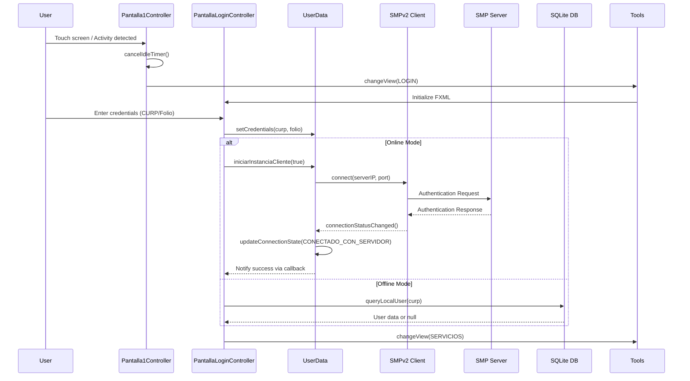
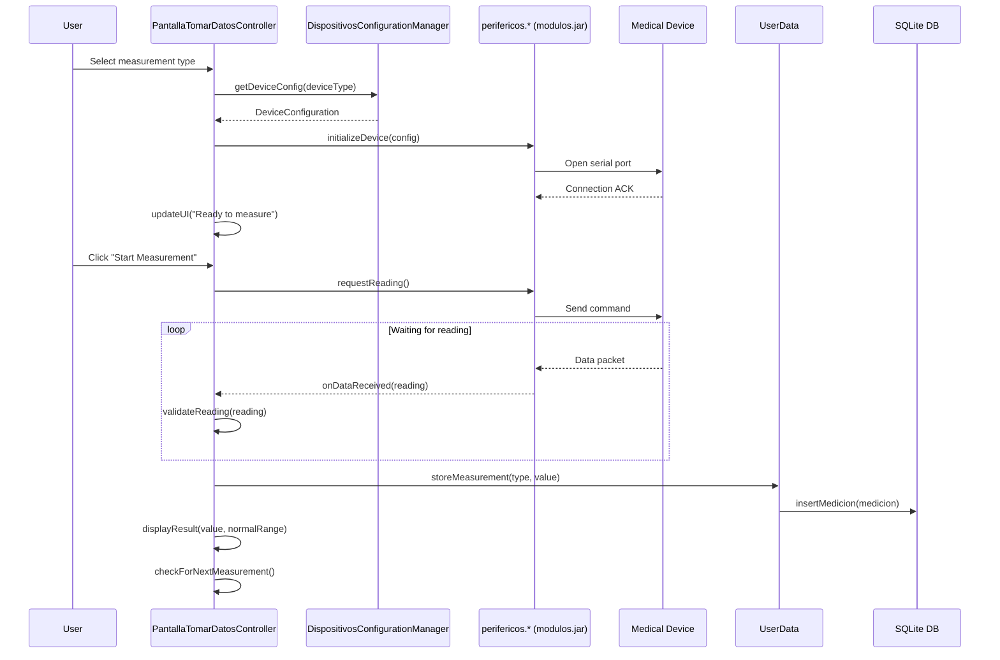
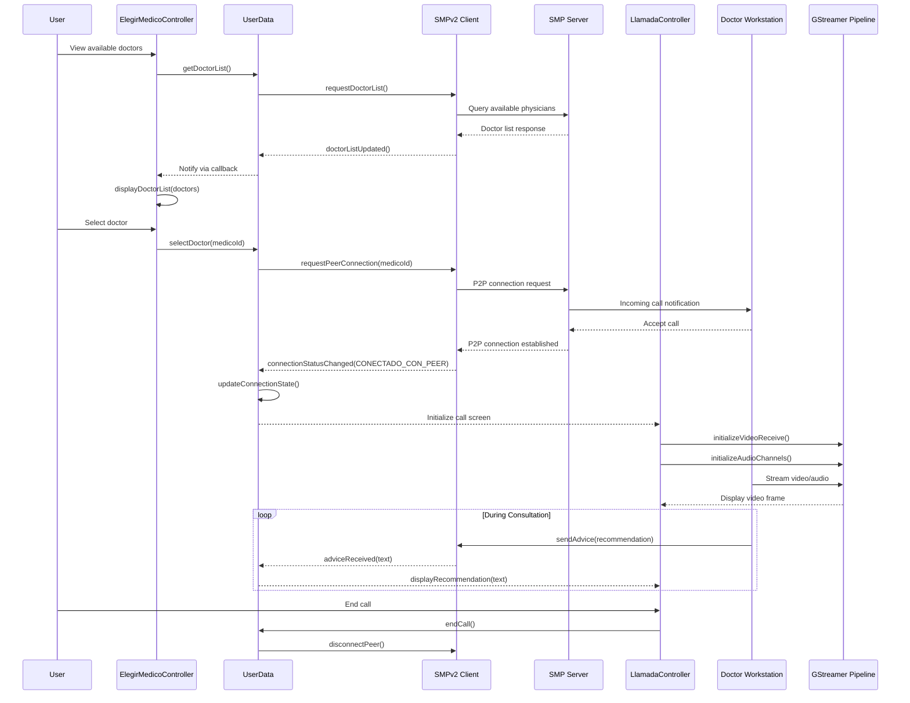
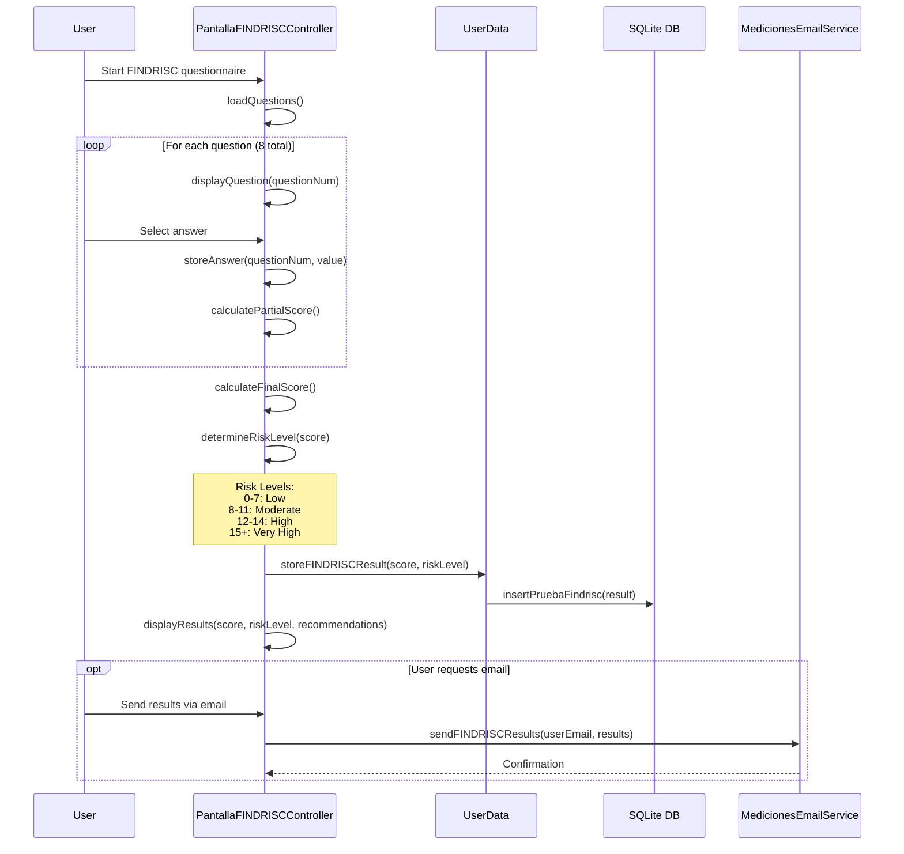
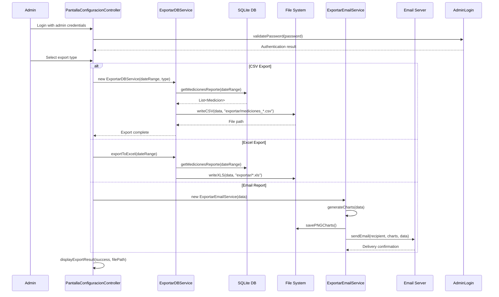
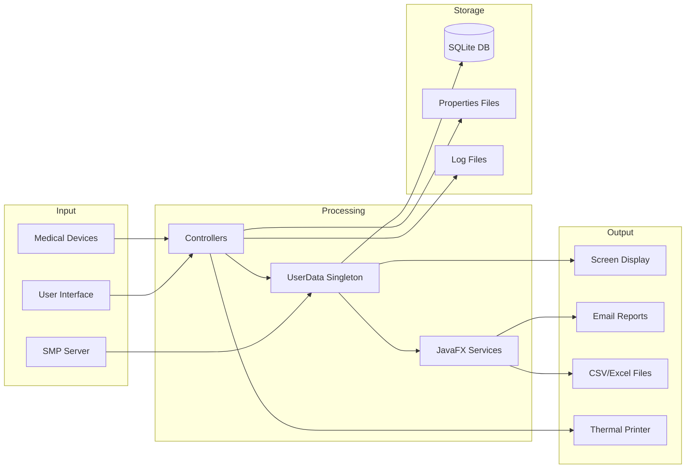
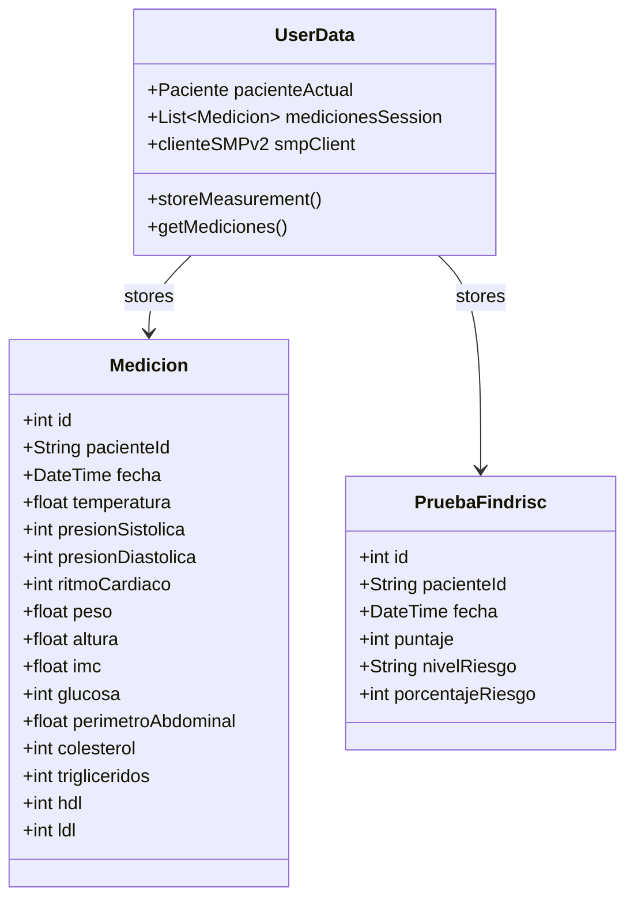
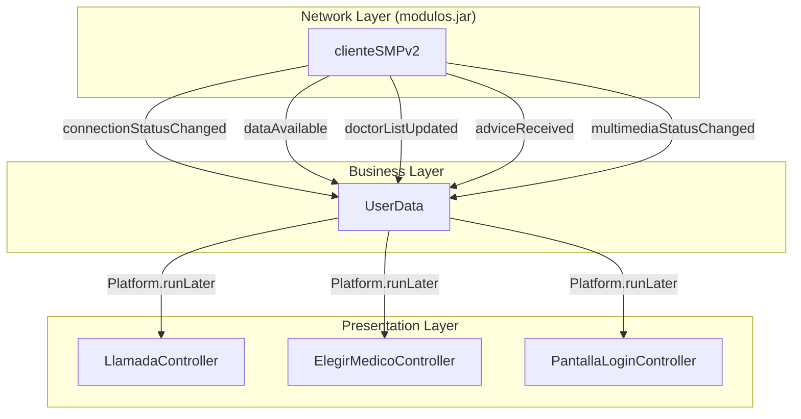
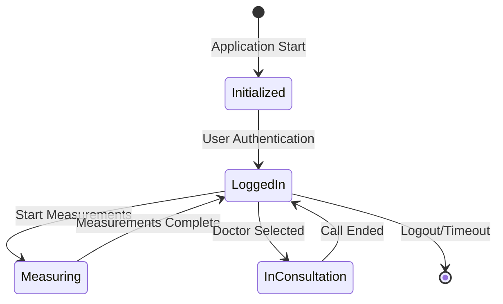
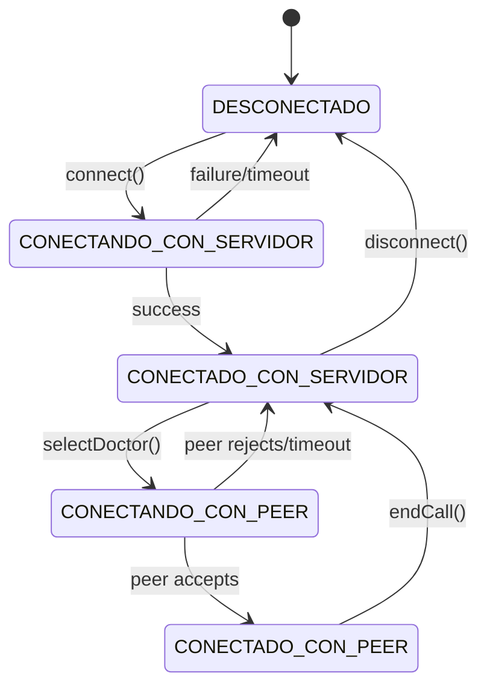

# Module Interactions

> **Last Updated:** 2026-02-22
> **Document Version:** 1.0
> **Related:** [Architecture Overview](architecture.md)

---

## Table of Contents

1. [Overview](#overview)
2. [Critical Workflows](#critical-workflows)
3. [Data Flow Diagrams](#data-flow-diagrams)
4. [Module Communication Matrix](#module-communication-matrix)
5. [Event System](#event-system)
6. [State Management](#state-management)

---

## Overview

A-Prevenir operates through a series of interconnected workflows that manage patient identification, health measurements, telemedicine consultations, and data export. This document traces the critical paths through the system.

### Communication Patterns Used

| Pattern | Usage | Modules Involved |
|---------|-------|------------------|
| **Direct Method Call** | UI → Business Logic | Controllers → UserData, Tools |
| **Singleton Access** | Global State | UserData.getInstance() |
| **Callback/Observer** | Network Events | SMPv2 → UserData |
| **JavaFX Platform.runLater** | Thread-safe UI | Background → UI Thread |
| **Service/Task** | Async Operations | Services → Background Threads |

---

## Critical Workflows

### Workflow 1: Patient Login & Authentication



**Entry Point:** `src/aPrevenir/Controladores/Pantalla1Controller.java`

**Key Code Paths:**
- Touch detection: `Pantalla1Controller.java:initialize()` - Sets up idle timer
- View transition: `Tools.java:changeView()` - Manages scene switching
- Authentication: `PantallaLoginController.java` - Credential validation
- Network init: `UserData.java:iniciarInstanciaCliente()` - SMPv2 client creation

---

### Workflow 2: Health Measurement Collection



**Entry Point:** `src/aPrevenir/Controladores/PantallaTomarDatosController.java`

**Supported Measurements:**

| Measurement | Device Class | Data Type |
|------------|--------------|-----------|
| Temperature | `TermometroPelicano` | Float (°C) |
| Blood Pressure | `baumanometroAD` | Int systolic/diastolic (mmHg) |
| Heart Rate | `baumanometroAD` | Int (bpm) |
| Weight | `basculaPelicano/basculaAD` | Float (kg) |
| Height | `estadimetro` | Float (cm) |
| Blood Glucose | `glucometro` | Int (mg/dL) |
| Waist Circumference | `CintaDigital` | Float (cm) |
| Lipid Panel | `CardioCheck` | Multiple values |

**Key Code Paths:**
- Device initialization: `PantallaTomarDatosController.java` - Device setup
- Configuration loading: `DispositivosConfigurationManager.java:loadConfig()`
- Measurement storage: `UserData.java` - Data aggregation
- Device communication: `perifericos.*` package in `modulos.jar`

---

### Workflow 3: Telemedicine Consultation



**Entry Point:** `src/aPrevenir/Controladores/ElegirMedicoController.java`

**Key Code Paths:**
- Doctor listing: `ElegirMedicoController.java` - UI for physician selection
- P2P connection: `UserData.java:iniciarInstanciaCliente()` - Network management
- Video handling: `LlamadaController.java` - GStreamer integration
- Recommendations: `UserData.java:adviceReceived()` - Display medical advice

**Connection States:**

```
DESCONECTADO → CONECTANDO_CON_SERVIDOR → CONECTADO_CON_SERVIDOR
                                              ↓
                                    CONECTANDO_CON_PEER
                                              ↓
                                    CONECTADO_CON_PEER
```

---

### Workflow 4: FINDRISC Diabetes Risk Assessment



**Entry Point:** `src/aPrevenir/Controladores/PantallaFINDRISCController.java`

**FINDRISC Scoring Factors:**
1. Age
2. BMI
3. Waist circumference
4. Physical activity
5. Vegetable/fruit consumption
6. Hypertension medication
7. High blood glucose history
8. Family diabetes history

---

### Workflow 5: Data Export & Reporting



**Entry Point:** `src/aPrevenir/Controladores/PantallaConfiguracionController.java`

**Export Outputs:**
- CSV files: `exportar/exportar_mediciones_*.csv`
- Excel files: `exportar/medicionesA_Prevenir.xls`
- Chart images: `exportar/*Chart.png`

---

## Data Flow Diagrams

### Patient Data Flow



### Measurement Data Structure



---

## Module Communication Matrix

### Direct Dependencies

| Caller Module | Called Module | Method/Interface | Frequency |
|--------------|---------------|------------------|-----------|
| All Controllers | `UserData` | `getInstance()` | Every operation |
| All Controllers | `Tools` | `changeView()`, `showAlert()` | Screen transitions |
| `PantallaTomarDatosController` | `DispositivosConfigurationManager` | `loadConfig()` | Device init |
| `PantallaConfiguracionController` | `AdminLoginManager` | `validatePassword()` | Admin login |
| `LlamadaController` | `UserData` | Network callbacks | During calls |
| `UserData` | `clienteSMPv2` | All network operations | Network activity |
| Services | `AprevenirLocalDB` | Database queries | Data operations |

### Callback Relationships



---

## Event System

### Event Types

| Event | Source | Handler | Description |
|-------|--------|---------|-------------|
| `connectionStatusChanged` | SMPv2 | UserData | Network state change |
| `doctorListUpdated` | SMPv2 | UserData → ElegirMedicoController | Available doctors refresh |
| `adviceReceived` | SMPv2 | UserData → LlamadaController | Medical recommendation |
| `dataAvailable` | SMPv2 | UserData | Incoming data packet |
| `multimediaStatusChanged` | SMPv2 | UserData → LlamadaController | Video/audio status |
| `deviceStateChanged` | perifericos.* | Controllers | Device connection status |

### Thread Safety Pattern

All UI updates from background threads use JavaFX's thread-safe pattern:

```java
// Pattern used throughout codebase
Platform.runLater(() -> {
    // UI update code here
    label.setText(newValue);
    updateConnectionIndicator(status);
});
```

**Locations:**
- `UserData.java` - All callback handlers
- `LlamadaController.java` - Video frame updates
- `Services/*.java` - Progress/completion updates

---

## State Management

### Application State (UserData Singleton)



### Connection State Machine



### Session Data Lifecycle

| Phase | Data Held | Persistence |
|-------|-----------|-------------|
| Pre-login | App configuration | Properties files |
| Login | User credentials, patient profile | Memory + Server |
| Measurement | Current readings, device states | Memory |
| Post-measurement | Aggregated measurements | SQLite DB |
| Consultation | Doctor info, video state | Memory |
| Export | Historical data | CSV/Excel files |

---

## See Also

- [Architecture Overview](architecture.md) - System structure
- [Design Decisions](design-decisions.md) - Why this design
- [API Overview](api-overview.md) - Interface details
- [Hardware Integration](hardware-integration.md) - Device workflows

---

*Document generated for A-Prevenir IDO architecture review*
