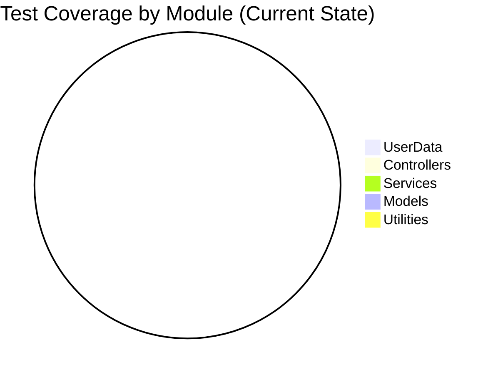
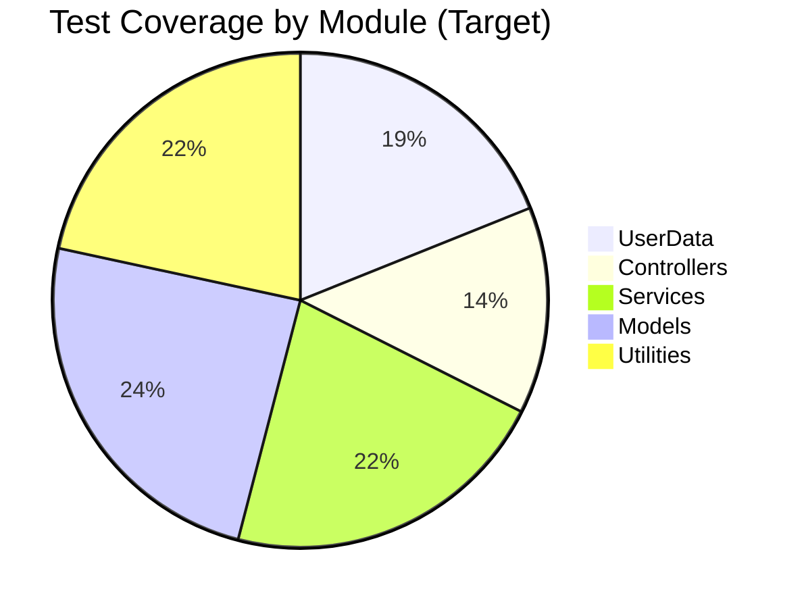

# Testing Strategy

> **Last Updated:** 2026-02-22
> **Document Version:** 1.0
> **Related:** [Architecture Overview](architecture.md), [Design Decisions](design-decisions.md)

---

## Table of Contents

1. [Current State Assessment](#current-state-assessment)
2. [Test Infrastructure Gaps](#test-infrastructure-gaps)
3. [Recommended Test Framework](#recommended-test-framework)
4. [Test Coverage Plan](#test-coverage-plan)
5. [Testing by Module](#testing-by-module)
6. [Hardware Testing Approach](#hardware-testing-approach)
7. [Implementation Roadmap](#implementation-roadmap)
8. [Test Templates](#test-templates)

---

## Current State Assessment

### Existing Test Infrastructure

| Component | Status | Notes |
|-----------|--------|-------|
| **Test Directory** | ❌ Empty | `/test/` exists but contains no tests |
| **Test Framework** | ❌ None | No JUnit or TestNG configured |
| **UI Testing** | ❌ None | No TestFX or similar |
| **Mock Framework** | ❌ None | No Mockito or EasyMock |
| **Coverage Tool** | ❌ None | No JaCoCo or similar |
| **CI/CD Pipeline** | ❌ None | No automated testing |

### Demo Mode as Manual Testing

The only testing mechanism is **Demo Mode**, activated via command line:

```bash
java APrevenir demo        # Simulates device readings
java APrevenir demo cabina # Demo + Workstation mode
```

**Demo Mode Limitations:**
- Manual execution only
- No assertions or validation
- Cannot test error conditions
- No regression detection
- Not documented

### Risk Assessment

| Risk Factor | Level | Impact |
|-------------|-------|--------|
| Refactoring without tests | 🔴 HIGH | Any change may break functionality |
| Bug regression | 🔴 HIGH | Fixed bugs may resurface |
| Integration issues | 🟡 MEDIUM | Module interactions untested |
| Performance degradation | 🟡 MEDIUM | No baseline metrics |
| Security vulnerabilities | 🟡 MEDIUM | No security tests |

**Overall Test Maturity:** ⚠️ **Level 0** (No systematic testing)

---

## Test Infrastructure Gaps

### Critical Gaps

| Gap ID | Description | Impact | Priority |
|--------|-------------|--------|----------|
| GAP-001 | No unit tests | Cannot refactor safely | P1 |
| GAP-002 | No integration tests | Module interactions untested | P1 |
| GAP-003 | No UI tests | Screen flows not validated | P2 |
| GAP-004 | No device mocks | Hardware required for testing | P2 |
| GAP-005 | No coverage metrics | Unknown code coverage | P2 |
| GAP-006 | No CI/CD | No automated quality gates | P3 |

### Gap Analysis by Module



**Target State (6 months):**



---

## Recommended Test Framework

### Technology Stack

| Component | Recommendation | Version | Purpose |
|-----------|----------------|---------|---------|
| **Unit Testing** | JUnit 5 | 5.10.x | Core test framework |
| **Assertions** | AssertJ | 3.24.x | Fluent assertions |
| **Mocking** | Mockito | 5.x | Mock dependencies |
| **UI Testing** | TestFX | 4.0.x | JavaFX testing |
| **Coverage** | JaCoCo | 0.8.x | Code coverage |
| **Database** | H2 | 2.x | In-memory test DB |

### Build Configuration

**Add to build.xml or migrate to Maven/Gradle:**

```xml
<!-- Maven dependencies -->
<dependencies>
    <!-- JUnit 5 -->
    <dependency>
        <groupId>org.junit.jupiter</groupId>
        <artifactId>junit-jupiter</artifactId>
        <version>5.10.0</version>
        <scope>test</scope>
    </dependency>

    <!-- AssertJ -->
    <dependency>
        <groupId>org.assertj</groupId>
        <artifactId>assertj-core</artifactId>
        <version>3.24.2</version>
        <scope>test</scope>
    </dependency>

    <!-- Mockito -->
    <dependency>
        <groupId>org.mockito</groupId>
        <artifactId>mockito-core</artifactId>
        <version>5.5.0</version>
        <scope>test</scope>
    </dependency>

    <!-- TestFX -->
    <dependency>
        <groupId>org.testfx</groupId>
        <artifactId>testfx-junit5</artifactId>
        <version>4.0.17</version>
        <scope>test</scope>
    </dependency>

    <!-- H2 for testing -->
    <dependency>
        <groupId>com.h2database</groupId>
        <artifactId>h2</artifactId>
        <version>2.2.224</version>
        <scope>test</scope>
    </dependency>
</dependencies>
```

### Test Directory Structure

```
test/
├── java/
│   └── aPrevenir/
│       ├── Modelos/
│       │   ├── UserDataTest.java
│       │   ├── MedicoTest.java
│       │   └── MedicionTest.java
│       ├── Controladores/
│       │   ├── Pantalla1ControllerTest.java
│       │   ├── PantallaLoginControllerTest.java
│       │   └── PantallaTomarDatosControllerTest.java
│       ├── services/
│       │   ├── MedicionesEmailServiceTest.java
│       │   └── ExportarDBServiceTest.java
│       ├── integration/
│       │   ├── LoginFlowIT.java
│       │   ├── MeasurementFlowIT.java
│       │   └── ConsultationFlowIT.java
│       ├── hardware/
│       │   └── MockDeviceTests.java
│       └── util/
│           ├── TestFixtures.java
│           ├── MockDeviceFactory.java
│           └── TestDatabaseHelper.java
└── resources/
    ├── test-config.properties
    └── test-data/
        ├── patients.json
        └── measurements.json
```

---

## Test Coverage Plan

### Coverage Targets

| Phase | Timeline | Target Coverage | Focus Areas |
|-------|----------|-----------------|-------------|
| Phase 1 | Weeks 1-4 | 30% | Models, Utilities |
| Phase 2 | Weeks 5-8 | 50% | Services, Critical paths |
| Phase 3 | Weeks 9-12 | 70% | Controllers, Integration |
| Ongoing | Maintenance | 80%+ | New code, Bug fixes |

### Priority Matrix

| Module | Test Priority | Complexity | Business Value |
|--------|--------------|------------|----------------|
| `UserData` | P1 | HIGH | CRITICAL |
| `Tools` | P1 | MEDIUM | HIGH |
| `AdminLoginManager` | P1 | LOW | HIGH (Security) |
| `PantallaLoginController` | P1 | MEDIUM | HIGH |
| `PantallaTomarDatosController` | P1 | HIGH | CRITICAL |
| `ExportarDBService` | P2 | MEDIUM | HIGH |
| `MedicionesEmailService` | P2 | MEDIUM | MEDIUM |
| `PantallaConfiguracionController` | P2 | MEDIUM | MEDIUM |
| `LlamadaController` | P3 | HIGH | MEDIUM |
| Other Controllers | P3 | LOW-MEDIUM | LOW-MEDIUM |

---

## Testing by Module

### 1. Model Classes (High Priority, Low Complexity)

**Target:** 90% coverage

**Test Focus:**
- Data validation
- Enum conversions
- Calculation methods

**Example Test Cases for `Medicion`:**

```java
@DisplayName("Medicion Model Tests")
class MedicionTest {

    @Test
    @DisplayName("should calculate IMC correctly")
    void calculateIMC_validInput_returnsCorrectValue() {
        // Given
        float peso = 70.0f;  // kg
        float altura = 175.0f;  // cm

        // When
        float imc = Medicion.calculateIMC(peso, altura);

        // Then
        assertThat(imc).isCloseTo(22.86f, within(0.01f));
    }

    @Test
    @DisplayName("should classify normal temperature")
    void classifyTemperature_normalValue_returnsNormal() {
        // Given
        float temperatura = 36.5f;

        // When
        NivelSignoVitalEnum nivel = Medicion.classifyTemperature(temperatura);

        // Then
        assertThat(nivel).isEqualTo(NivelSignoVitalEnum.NORMAL);
    }

    @Test
    @DisplayName("should flag high blood pressure")
    void classifyBloodPressure_highValues_returnsHigh() {
        // Given
        int sistolica = 145;
        int diastolica = 95;

        // When
        NivelSignoVitalEnum nivel = Medicion.classifyBloodPressure(sistolica, diastolica);

        // Then
        assertThat(nivel).isEqualTo(NivelSignoVitalEnum.ALTO);
    }
}
```

---

### 2. UserData (High Priority, High Complexity)

**Target:** 70% coverage

**Challenge:** Singleton pattern makes testing difficult

**Strategy:**
1. Add `reset()` method for test cleanup
2. Extract interfaces for network/database operations
3. Use reflection to reset singleton in tests (short-term)

**Example Test Cases:**

```java
@DisplayName("UserData Session Tests")
class UserDataTest {

    @BeforeEach
    void setUp() {
        // Reset singleton state
        UserData.resetForTesting();
    }

    @Test
    @DisplayName("should store patient data")
    void setPaciente_validPatient_storesData() {
        // Given
        Paciente paciente = TestFixtures.createTestPaciente();

        // When
        UserData.getInstance().setPaciente(paciente);

        // Then
        assertThat(UserData.getInstance().getPaciente())
            .isNotNull()
            .extracting(Paciente::getCurp)
            .isEqualTo(paciente.getCurp());
    }

    @Test
    @DisplayName("should aggregate measurements in session")
    void storeMeasurement_multipleReadings_aggregatesAll() {
        // Given
        UserData userData = UserData.getInstance();

        // When
        userData.storeMeasurement("temperatura", 36.5f);
        userData.storeMeasurement("glucosa", 95);
        userData.storeMeasurement("presionSistolica", 120);

        // Then
        assertThat(userData.getTemperatura()).isEqualTo(36.5f);
        assertThat(userData.getGlucosa()).isEqualTo(95);
        assertThat(userData.getPresionSistolica()).isEqualTo(120);
    }

    @Test
    @DisplayName("should clear session on logout")
    void clearSession_afterLogin_resetsAllData() {
        // Given
        UserData userData = UserData.getInstance();
        userData.setPaciente(TestFixtures.createTestPaciente());
        userData.storeMeasurement("temperatura", 36.5f);

        // When
        userData.clearSession();

        // Then
        assertThat(userData.getPaciente()).isNull();
        assertThat(userData.getTemperatura()).isNull();
    }
}
```

---

### 3. Services (High Priority, Medium Complexity)

**Target:** 80% coverage

**Test Focus:**
- Background task execution
- Database operations
- Email generation

**Example Test Cases for `ExportarDBService`:**

```java
@DisplayName("ExportarDBService Tests")
class ExportarDBServiceTest {

    private AprevenirLocalDB mockDatabase;
    private ExportarDBService service;

    @BeforeEach
    void setUp() {
        mockDatabase = mock(AprevenirLocalDB.class);
    }

    @Test
    @DisplayName("should export measurements to CSV")
    void exportMediciones_validData_createsCSVFile() throws Exception {
        // Given
        List<Medicion> mediciones = TestFixtures.createTestMediciones(10);
        when(mockDatabase.getMedicionesReporte(any(), any())).thenReturn(mediciones);

        service = new ExportarDBService(
            LocalDate.of(2026, 1, 1),
            LocalDate.of(2026, 2, 22),
            ExportType.MEDICIONES
        );

        // When
        service.setDatabase(mockDatabase);
        String filePath = service.call();

        // Then
        assertThat(filePath).endsWith(".csv");
        assertThat(new File(filePath)).exists();

        List<String> lines = Files.readAllLines(Paths.get(filePath));
        assertThat(lines).hasSize(11); // Header + 10 rows
    }

    @Test
    @DisplayName("should handle empty result set")
    void exportMediciones_noData_createsEmptyCSV() throws Exception {
        // Given
        when(mockDatabase.getMedicionesReporte(any(), any())).thenReturn(Collections.emptyList());

        service = new ExportarDBService(
            LocalDate.of(2026, 1, 1),
            LocalDate.of(2026, 2, 22),
            ExportType.MEDICIONES
        );

        // When
        service.setDatabase(mockDatabase);
        String filePath = service.call();

        // Then
        List<String> lines = Files.readAllLines(Paths.get(filePath));
        assertThat(lines).hasSize(1); // Header only
    }
}
```

---

### 4. Controllers (Medium Priority, Medium Complexity)

**Target:** 50% coverage

**Test Focus:**
- FXML binding
- Event handling
- Navigation flows

**UI Testing with TestFX:**

```java
@ExtendWith(ApplicationExtension.class)
@DisplayName("PantallaLoginController UI Tests")
class PantallaLoginControllerTest {

    @Start
    void start(Stage stage) {
        // Load FXML and set up stage
        FXMLLoader loader = new FXMLLoader(
            getClass().getResource("/aPrevenir/Vistas/kiosco/PantallaLogin.fxml")
        );
        Parent root = loader.load();
        stage.setScene(new Scene(root));
        stage.show();
    }

    @Test
    @DisplayName("should navigate to services on successful login")
    void login_validCredentials_navigatesToServices(FxRobot robot) {
        // Given
        robot.clickOn("#curpField").write("VALID_CURP_123");
        robot.clickOn("#folioField").write("12345");

        // When
        robot.clickOn("#loginButton");

        // Then
        verifyThat("#serviciosPane", isVisible());
    }

    @Test
    @DisplayName("should show error on invalid credentials")
    void login_invalidCredentials_showsError(FxRobot robot) {
        // Given
        robot.clickOn("#curpField").write("INVALID");
        robot.clickOn("#folioField").write("");

        // When
        robot.clickOn("#loginButton");

        // Then
        verifyThat(".alert", isVisible());
    }
}
```

---

### 5. Integration Tests

**Target:** Key workflows covered

**Test Focus:**
- End-to-end user flows
- Module interactions
- Database persistence

```java
@DisplayName("Login Flow Integration Tests")
class LoginFlowIT {

    private TestDatabaseHelper dbHelper;

    @BeforeAll
    static void setupDatabase() {
        dbHelper = new TestDatabaseHelper();
        dbHelper.initializeTestDatabase();
    }

    @Test
    @DisplayName("should complete full login flow")
    void fullLoginFlow_registeredUser_succeeds() {
        // Given
        Paciente testPatient = dbHelper.createTestPatient();

        // When
        boolean loginResult = LoginService.authenticate(
            testPatient.getCurp(),
            testPatient.getFolio()
        );

        // Then
        assertThat(loginResult).isTrue();
        assertThat(UserData.getInstance().getPaciente())
            .isNotNull()
            .extracting(Paciente::getCurp)
            .isEqualTo(testPatient.getCurp());
    }

    @Test
    @DisplayName("should persist measurements after measurement flow")
    void measurementFlow_completeReadings_persistsToDatabase() {
        // Given - Login first
        Paciente testPatient = dbHelper.createTestPatient();
        LoginService.authenticate(testPatient.getCurp(), testPatient.getFolio());

        // When - Simulate measurements
        UserData userData = UserData.getInstance();
        userData.storeMeasurement("temperatura", 36.8f);
        userData.storeMeasurement("glucosa", 92);
        userData.storeMeasurement("presionSistolica", 118);
        userData.storeMeasurement("presionDiastolica", 76);

        // Persist to database
        MeasurementService.saveSession();

        // Then
        List<Medicion> savedMediciones = dbHelper.getMedicionesForPatient(testPatient.getId());
        assertThat(savedMediciones).hasSize(1);
        assertThat(savedMediciones.get(0).getTemperatura()).isEqualTo(36.8f);
    }
}
```

---

## Hardware Testing Approach

### Challenge

Hardware devices cannot be connected during automated tests.

### Solution: Mock Device Layer

```java
public interface DeviceInterface {
    void connect();
    void disconnect();
    boolean isConnected();
    void startReading();
    void setCallback(DeviceCallback callback);
}

public class MockGlucometer implements DeviceInterface {

    private DeviceCallback callback;
    private boolean connected = false;

    @Override
    public void connect() {
        connected = true;
    }

    @Override
    public void startReading() {
        // Simulate reading after delay
        CompletableFuture.delayedExecutor(500, TimeUnit.MILLISECONDS)
            .execute(() -> {
                callback.onDataReceived(generateMockReading());
            });
    }

    private int generateMockReading() {
        // Return realistic glucose value
        return 85 + new Random().nextInt(30);  // 85-114 mg/dL
    }
}
```

### Mock Device Factory

```java
public class MockDeviceFactory {

    public static DeviceInterface createMockDevice(PerifericoEnum type) {
        switch (type) {
            case GLUCOMETRO:
                return new MockGlucometer();
            case BASCULA:
                return new MockScale();
            case BAUMANOMETRO:
                return new MockBloodPressureMonitor();
            case TERMOMETRO:
                return new MockThermometer();
            default:
                throw new IllegalArgumentException("Unknown device: " + type);
        }
    }

    public static void configureMockMode(boolean enabled) {
        System.setProperty("aprevenir.mock.devices", String.valueOf(enabled));
    }
}
```

### Hardware Test Scenarios

| Scenario | Mock Behavior | Validation |
|----------|---------------|------------|
| Normal reading | Return valid value | Value stored correctly |
| Timeout | No response | Timeout error shown |
| Invalid reading | Out-of-range value | Validation error shown |
| Connection lost | Disconnect mid-read | Recovery attempted |
| Device not found | Connect fails | Error message displayed |

```java
@DisplayName("Device Integration Tests with Mocks")
class DeviceIntegrationTest {

    @BeforeEach
    void setUp() {
        MockDeviceFactory.configureMockMode(true);
    }

    @Test
    @DisplayName("should handle glucose reading")
    void glucoseReading_normalOperation_storesValue() {
        // Given
        MockGlucometer glucometer = new MockGlucometer();
        AtomicInteger receivedValue = new AtomicInteger();

        glucometer.setCallback(value -> receivedValue.set((Integer) value));

        // When
        glucometer.connect();
        glucometer.startReading();

        // Wait for async response
        await().atMost(1, TimeUnit.SECONDS)
            .until(() -> receivedValue.get() > 0);

        // Then
        assertThat(receivedValue.get()).isBetween(70, 200);
    }

    @Test
    @DisplayName("should handle device timeout")
    void deviceReading_timeout_showsError() {
        // Given
        MockGlucometer glucometer = new MockGlucometer();
        glucometer.setSimulateTimeout(true);

        AtomicReference<DeviceError> error = new AtomicReference<>();
        glucometer.setCallback(new DeviceCallback() {
            @Override
            public void onError(DeviceError e) {
                error.set(e);
            }
        });

        // When
        glucometer.connect();
        glucometer.startReading();

        // Then
        await().atMost(35, TimeUnit.SECONDS)
            .until(() -> error.get() != null);

        assertThat(error.get().getCode()).isEqualTo(DeviceError.TIMEOUT);
    }
}
```

---

## Implementation Roadmap

### Phase 1: Foundation (Weeks 1-2)

| Task | Effort | Output |
|------|--------|--------|
| Set up JUnit 5 | 0.5 days | Test framework configured |
| Add Mockito | 0.5 days | Mocking available |
| Create test structure | 1 day | Directory layout |
| Write test fixtures | 2 days | Reusable test data |
| Document test patterns | 1 day | Testing guidelines |

**Deliverables:**
- [ ] JUnit 5 integrated with build
- [ ] Test directory structure created
- [ ] TestFixtures class with common test data
- [ ] 5 example tests demonstrating patterns

### Phase 2: Model Tests (Weeks 3-4)

| Task | Effort | Output |
|------|--------|--------|
| Test Medicion | 2 days | Model validation tests |
| Test UserData | 3 days | Session management tests |
| Test Enums | 1 day | Enum conversion tests |
| Test utilities | 2 days | Tools class tests |

**Deliverables:**
- [ ] 30% code coverage
- [ ] All model classes have tests
- [ ] Critical paths in UserData tested

### Phase 3: Service Tests (Weeks 5-6)

| Task | Effort | Output |
|------|--------|--------|
| Mock database | 1 day | Database abstraction |
| Test ExportarDBService | 2 days | Export functionality |
| Test MedicionesEmailService | 2 days | Email generation |
| Test AdminLoginManager | 1 day | Authentication |

**Deliverables:**
- [ ] 50% code coverage
- [ ] All services have unit tests
- [ ] Database mocking operational

### Phase 4: Integration Tests (Weeks 7-8)

| Task | Effort | Output |
|------|--------|--------|
| Set up TestFX | 1 day | UI testing framework |
| Test login flow | 2 days | E2E login tests |
| Test measurement flow | 3 days | E2E measurement tests |
| Test export flow | 2 days | E2E export tests |

**Deliverables:**
- [ ] 60% code coverage
- [ ] 3+ integration tests
- [ ] Critical workflows tested

### Phase 5: CI/CD & Maintenance (Week 9+)

| Task | Effort | Output |
|------|--------|--------|
| Set up JaCoCo | 1 day | Coverage reporting |
| Create CI pipeline | 2 days | Automated testing |
| Coverage gates | 0.5 days | Quality enforcement |
| Documentation | 1 day | Test documentation |

**Deliverables:**
- [ ] 70% code coverage
- [ ] CI pipeline running tests on commit
- [ ] Coverage reports generated

---

## Test Templates

### Unit Test Template

```java
package aPrevenir.Modelos;

import org.junit.jupiter.api.*;
import static org.assertj.core.api.Assertions.*;
import static org.mockito.Mockito.*;

@DisplayName("ClassName Tests")
class ClassNameTest {

    private ClassName instance;
    private Dependency mockDependency;

    @BeforeEach
    void setUp() {
        mockDependency = mock(Dependency.class);
        instance = new ClassName(mockDependency);
    }

    @AfterEach
    void tearDown() {
        // Cleanup if needed
    }

    @Nested
    @DisplayName("methodName")
    class MethodNameTests {

        @Test
        @DisplayName("should do X when Y")
        void methodName_condition_expectedResult() {
            // Given
            // Set up preconditions

            // When
            var result = instance.methodName(input);

            // Then
            assertThat(result).isEqualTo(expected);
        }

        @Test
        @DisplayName("should throw exception when invalid input")
        void methodName_invalidInput_throwsException() {
            // Given
            var invalidInput = null;

            // When/Then
            assertThatThrownBy(() -> instance.methodName(invalidInput))
                .isInstanceOf(IllegalArgumentException.class)
                .hasMessageContaining("expected message");
        }
    }
}
```

### Integration Test Template

```java
package aPrevenir.integration;

import org.junit.jupiter.api.*;
import static org.assertj.core.api.Assertions.*;

@DisplayName("Feature Integration Tests")
@Tag("integration")
class FeatureIT {

    private static TestDatabaseHelper dbHelper;

    @BeforeAll
    static void setUpClass() {
        dbHelper = new TestDatabaseHelper();
        dbHelper.initializeTestDatabase();
    }

    @AfterAll
    static void tearDownClass() {
        dbHelper.cleanup();
    }

    @BeforeEach
    void setUp() {
        dbHelper.resetData();
    }

    @Test
    @DisplayName("should complete full workflow")
    void fullWorkflow_happyPath_succeeds() {
        // Given - Set up initial state

        // When - Execute workflow steps

        // Then - Verify final state
    }
}
```

### UI Test Template (TestFX)

```java
package aPrevenir.Controladores;

import org.junit.jupiter.api.*;
import org.junit.jupiter.api.extension.ExtendWith;
import org.testfx.api.FxRobot;
import org.testfx.framework.junit5.*;
import static org.testfx.assertions.api.Assertions.*;

@ExtendWith(ApplicationExtension.class)
@DisplayName("ControllerName UI Tests")
class ControllerNameTest {

    @Start
    void start(Stage stage) throws Exception {
        FXMLLoader loader = new FXMLLoader(
            getClass().getResource("/aPrevenir/Vistas/kiosco/Screen.fxml")
        );
        Parent root = loader.load();
        stage.setScene(new Scene(root));
        stage.show();
    }

    @Test
    @DisplayName("should display element on load")
    void onLoad_elementVisible(FxRobot robot) {
        verifyThat("#elementId", isVisible());
    }

    @Test
    @DisplayName("should respond to button click")
    void buttonClick_validInput_performsAction(FxRobot robot) {
        // Given
        robot.clickOn("#inputField").write("test");

        // When
        robot.clickOn("#submitButton");

        // Then
        verifyThat("#resultLabel", hasText("Expected Result"));
    }
}
```

---

## See Also

- [Architecture Overview](architecture.md) - System structure
- [Design Decisions](design-decisions.md) - Refactoring recommendations
- [API Overview](api-overview.md) - Interfaces to test
- [Getting Started](getting-started.md) - Development setup

---

*Document generated for A-Prevenir IDO architecture review*
